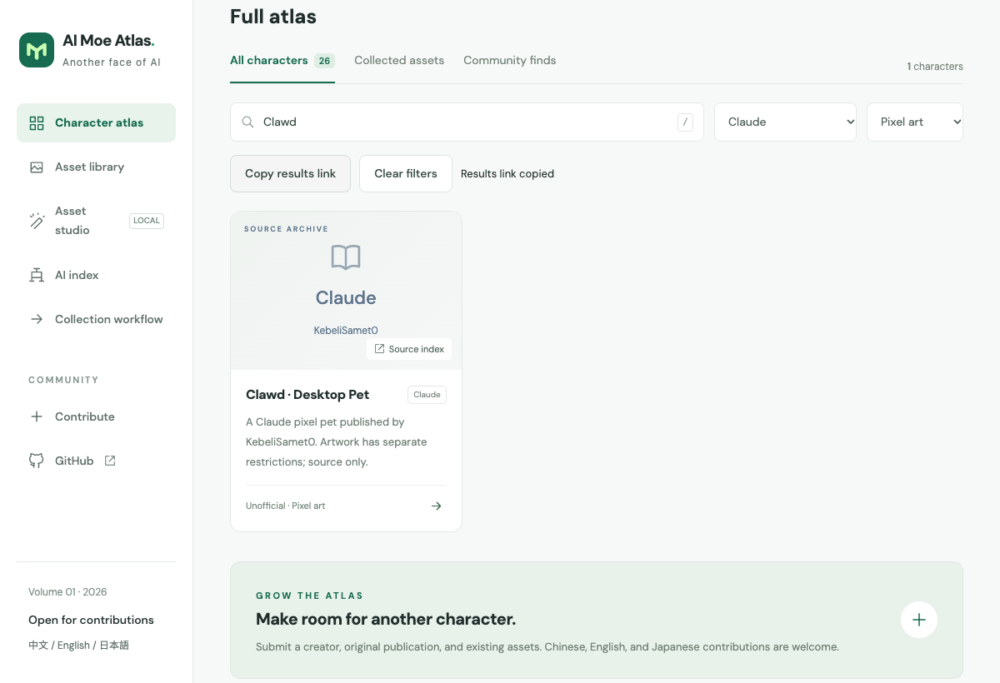

# AI Moe Atlas

[中文](README.md) · [English](README.en.md) · [日本語](README.ja.md)

Discover another side of the AI you use, find original creators, and bring usable assets into your work.

## What you can do

- Browse 26 source entries, 12 AI products/families, and 8 featured characters. Atlas display uses for 13 entries were checked against retained evidence; 13 asset packs are downloadable.
- Share search, product, style, and entry-type filters in a link; restore them across reloads, browser history, and language changes.
- The studio offers full-portrait and avatar canvases, reviewed introduction cards, and custom settings. Export matches the visibly credited preview; the ZIP preserves originals, evidence and processing records.
- Unpublished original work needs no public URL. Supply a creator, usage statement and original-work confirmation; it stays in the local export and is never added to the public atlas.

For discovering characters, finding artists, and preparing credited non-commercial assets. Images stay in your browser. Read each artwork’s terms.

[Open the atlas](https://selinlee.github.io/ai-moe-atlas/en/) · [Local studio](https://selinlee.github.io/ai-moe-atlas/en/studio/)



## 15-second walkthrough

[15-second walkthrough · MP4](public/demo/discovery-en.mp4)

Recorded in local Chrome, with five steps held for 3 seconds each: filter by style → choose a product → search and copy → reopen results → view the entry. The example is link-only and contains no third-party artwork. This is not a full export tutorial.

## Terms and provenance

Collected from 上善无形’s Bilibili post, Small-tailqwq/dsh-deep-whale and [ZipZipPipe’s Pixiv collection](https://www.pixiv.net/artworks/148186519). The original three packs retain **CC BY-NC-SA 4.0**. The ten new GPT, Gemini, Claude, Kimi, Qwen, GLM, Grok, Doubao, Llama and MiniMax packs use the creator’s **attribution and non-commercial** terms; they are not relabeled with DeepSeek’s CC license. The code MIT license excludes third-party artwork.

Prefer creator-published high-resolution originals. If unavailable, a fixed depiction may be generated from collected references, preserving identity and provenance and labeling the generated derivative separately. It must not be presented as a creator original or recovered detail. This permitted future workflow is not an available feature, grants no additional upstream rights, and does not allow inventing unrelated characters or lore.

## Maintain

- [Studio guide](docs/STUDIO.en.md)
- [Contribution guide](docs/CONTRIBUTING.en.md)
- [Collection manual](docs/COLLECTION.en.md)
- [Artwork terms](RIGHTS.md)
- [Source records](content/sources/) and [Bilibili leads](content/leads.json)
- [Project constraints](AGENTS.md)

`content/characters.json` stores trilingual entries. `public/collected/` contains original bytes, evidence, and normalized files; `public/packs/` holds downloadable archives. Originals are immutable. GitHub files are pinned to commits; derivatives reference their parent SHA-256.

Pushes to main validate, test, build, and deploy through GitHub Actions. Pull requests only build. With a local server running, run `npm run test:browser` to exercise the site in installed Chrome.

## Run

Node.js 22.12+ (24 recommended) and npm are required.

```sh
npm ci
npm run dev
# http://localhost:4321/ai-moe-atlas/en/
npm test
npm run build
```

## Collect and normalize

```sh
npm run discover -- --platform bilibili --query '蓝色大肥鱼' --limit 20
npm run discover -- --platform github --query 'AI mascot' --limit 20
# Review sources and artwork permissions in content/sources/*.json first
npm run collect
npm run assets
npm run validate
```

Bilibili discovery uses an isolated installed Google Chrome session. Add `--visible` if interactive verification is required. Personal browser profiles are never used. GitHub search requires authenticated `gh`.

**1024 px files are resampled outputs, not recovered detail.** Prefer the creator’s higher-resolution original. This release does not integrate neural super-resolution, generative restoration, or automatic background removal. Full original composition is retained.

## Scope

An indexed source is not automatically a downloadable asset. Nine AI designs from a Bilibili video series are indexed; creator-published originals and terms for GPT, Gemini, Claude, Kimi, Qwen, GLM, Grok, Doubao, Llama and MiniMax have now been collected. Animated-pet adaptation, video frame extraction, automatic cutouts, and AI super-resolution are outside this release. Never invent artwork to fill gaps.

[Baseline coverage and cross-project reuse review](docs/BASELINES.en.md)
