# AI Moe Atlas

[中文](README.md) · [English](README.en.md) · [日本語](README.ja.md)

Explore AI character designs, usable assets and community fan works with traceable sources. Pick a category, or meet the characters below.

<a id="assets"></a>

[Open the character atlas](https://selinlee.github.io/ai-moe-atlas/en/) · [Download asset packs](https://selinlee.github.io/ai-moe-atlas/en/assets/) · [Search all resources](https://selinlee.github.io/ai-moe-atlas/en/collection/)

<p align="center">
  <a href="public/generated/rough-doodle-v1/openai/doodle-v1.png"></a>
  <a href="public/generated/rough-doodle-v1/gemini/doodle-v1.png"></a>
  <a href="public/generated/rough-doodle-v1/claude/doodle-v1.png"></a>
  <a href="public/generated/rough-doodle-v1/deepseek/doodle-v1.png"></a>
  <a href="public/generated/rough-doodle-v1/kimi/doodle-v1.png"></a>
  <a href="public/generated/rough-doodle-v1/qwen/doodle-v1.png"></a>
</p>

These six doodles are AI-generated adaptations. Community designs for GPT, Gemini, Claude, Kimi and Qwen: ZipZipPipe. DeepSeek attribution: 上善无形 → ZipZipPipe. [Sources and usage terms](docs/DOODLE.en.md)

## Resource directory

<!-- category-picks:references -->
**[🧸 Project creations](#references)** · 106 entries\
[Character turnarounds](https://selinlee.github.io/ai-moe-atlas/en/chibi/) · [Doodle avatars](docs/DOODLE.en.md) · [Doodle emotes](https://selinlee.github.io/ai-moe-atlas/en/emotes/) · [AI fan videos on Douyin](https://www.douyin.com/user/MS4wLjABAAAAa3lc_FI5WmPENMLwdN7Ij4r5iNxAM09Ny0rPcB2Ow4E) · [AI fan videos on Bilibili](https://space.bilibili.com/3706970263521942)

<!-- category-picks:characters -->
**[🎨 Character atlas](#characters)** · 129 entries\
[GPT · ZipZipPipe](https://selinlee.github.io/ai-moe-atlas/en/characters/zipzippipe-chatgpt/) · [Gemini Pro · Portrait and expressions](https://selinlee.github.io/ai-moe-atlas/en/characters/qinv-gemini-pro/) · [Cohere · School Edition](https://selinlee.github.io/ai-moe-atlas/en/characters/school-op-cohere/)

<!-- category-picks:personas -->
**[💬 Character personality prompts](#personas)** · 11 cards\
[GLM the fox · ZCode](https://github.com/tzzzzzzzx/zcode-persona-modes/blob/084fce319f06847b2e62a118ba1906604bc8821c/persona-modes/modes/glm_chan.md) · [Claude “Xiao Ke” · deslop writing card](https://github.com/Charliechen114514/deslop/blob/70e6a9478baaa270f3c5ca3868e58502d32e6e8c/example/personas/claude-girl.md) · [DeepSeek whale girl · QQ chat](https://github.com/whyever77/dafeiyu-astrbot/blob/64274354c4331591620a925b3df498725df4564f/persona/%E5%A4%A7%E8%82%A5%E9%B1%BC-%E4%BA%BA%E6%A0%BC.md)

<!-- category-picks:songs -->
**[🎵 Songs](#songs)** · 218 tracks\
[Humans Are Cats · Fat Fish cover](https://www.bilibili.com/video/BV1fYpn6SEk9/) · [My Sorrow Is Made of Water · White Dragon Girl redraw](https://www.bilibili.com/video/BV14Cnu64ErL/) · [Glass and Slow · Original by 鲸歌](https://www.bilibili.com/video/BV1tV1MzvEuq/)

<!-- category-picks:stickers -->
**[🗨️ Stickers & reaction images](#stickers)** · 13 entries\
[雾雪 · original Fat Fish and GPT-girl sticker publication](https://www.bilibili.com/video/BV13xnt6QE6s/) · [Gemini Cat Girl · Reactions and Earless Variants](https://www.bilibili.com/opus/1264669110489317411) · [Blue Fat Fish · Animated and Still Sticker Index](https://github.com/wedfkewn/blue-fat-fish-meme-pack/blob/b1315fdcc03283a34f6ece1ec16f59a1defb6cb1/README.md)

<!-- category-picks:rigs -->
**[🧩 Rigged models](#rigs)** · 12 entries\
[Oujingjing · Live2D original release](https://www.bilibili.com/video/BV1djx46iEuH/) · [水原镜 · Blue Fat Fish MMD distribution](https://www.aplaybox.com/details/model/j9z4quaACJV1) · [木子恶魔 · Blue Fat Fish VRM original release](https://www.aplaybox.com/details/model/ayXkRzVflmnd)

<!-- category-picks:comics -->
**[📖 Comics & serials](#comics)** · 72 works\
[AI GIRLS · First Meeting · Original Comic](https://www.bilibili.com/video/BV15Npa6zE44/) · [Kawamura · Yoshida’s Halloween](https://note.com/chatgpt_ysd/n/n43469edeace1) · [Workfine comic retrospective](https://note.com/workfine/n/ndecce733b117)

<!-- category-picks:animations -->
**[🎬 Animation & fan videos](#animations)** · 1327 records\
[What If the Chat Window Were Her Whole World?](https://www.bilibili.com/video/BV1xCai6aE9g/) · [Liberate Claude · Game Demo](https://www.bilibili.com/video/BV18Syoz3ENe/) · [Then Go Ask Doubao!](https://www.bilibili.com/video/BV1HX8v6UErL/)

<!-- category-picks:desktop-pets -->
**[🐾 Pets & interactive projects](#desktop-pets)** · 223 projects\
[dsh-TUI · Deepy the Pixel Whale](https://github.com/ccch1mneyyy/dsh-TUI/blob/bf8a23c717c7b066190ceb39420cb80614fbc184/README_ZH.md) · [Copiwaifu · Live2D coding companion](https://github.com/Panzer-Jack/Copiwaifu/blob/ce56b4cdae67e6a31e02ba4cb2e0159121664bd5/README.zh-CN.md) · [Gemini Girl · Two-form desktop pet](https://github.com/xiaoxindada/GeminiDesktopPet/blob/479e040bf499fa980b13e6a532b05cf48090549b/README.md)

<!-- category-picks:sources -->
**[📚 Creator works & sources](#sources)** · 273 sources\
[Shangshan · Whale Girl original](https://www.bilibili.com/opus/1231977657712771073) · [ZipZipPipe · Gemini family illustration](https://www.bilibili.com/opus/1273349110528737288) · [ProtocolFour · creator sketches](https://note.com/pfhq/n/n3aab23ac0447)

<a id="references"></a>

### 🧸 Project creations

SelinLee used AI to make turnarounds, character sheets, doodle avatars and emotes from community designs. Each image carries its source artwork’s sharing terms. See individual videos for visual and music credits. [Sources, credits and usage terms](public/generated/README.md#en)

[7 chibi turnarounds](#chibi-gallery) · [6 standard and chibi sheets](#v5-gallery) · [7 doodles and prompt templates](#doodle-gallery) · [84 doodle emotes](https://selinlee.github.io/ai-moe-atlas/en/emotes/)

<a id="characters"></a>

### 🎨 Character atlas

Added five full-body designs by R.Nori. The Gemini entry also links the ten-version drawing process. [Gemini · rainbow ponytail](https://selinlee.github.io/ai-moe-atlas/en/characters/rnori-gemini-rainbow-ponytail/) · [Five full-body designs](https://selinlee.github.io/ai-moe-atlas/en/resources/?category=sources#rnori-note-five-ai-designs)

Added four AI self-portrait character cards published by Mikamika33, with the character and image provenance documented in the original post. [Orange-accent secretary · ChatGPT](https://selinlee.github.io/ai-moe-atlas/en/characters/mikamika-chatgpt-orange-secretary/) · [Creator’s four character cards](https://selinlee.github.io/ai-moe-atlas/en/resources/?category=sources#mikamika-ai-self-portrait-set)

Added Kawamura’s Muse to the character atlas and verified images from Yumie’s Copilot and Claude design post. [Muse · character entry](https://selinlee.github.io/ai-moe-atlas/en/characters/kawamura-muse-lavender/) · [Yumie · creator designs](https://selinlee.github.io/ai-moe-atlas/en/resources/?category=sources#yumie-copilot-claude-personifications)

Kawamura’s cast introduction documents the designs for Yoshida, Kuro and the blond presenter. [Yoshida · character design](https://selinlee.github.io/ai-moe-atlas/en/characters/kawamura-yoshida-chatgpt/)

Added JosCom’s hand-drawn mascot design with links to the pinned sketch and character guide. [JosCom’s hand-drawn design](https://selinlee.github.io/ai-moe-atlas/en/characters/joscom-original-hand-drawn-mascot/)

Added five of トゥ’s character designs. Source URLs and hashes were verified for 19 images across four creator articles. [Goma · Toaster Muse](https://selinlee.github.io/ai-moe-atlas/en/characters/tou-goma-muse/) · [Four AI Regulars at JACK](https://selinlee.github.io/ai-moe-atlas/en/resources/?category=sources#kurosaki-jack-four-ai-characters)

Kairos_C’s MiniMax director design has been added with its creator-published character description. [MiniMax Hailuo Girl](https://selinlee.github.io/ai-moe-atlas/en/characters/kairos-minimax-hailuo-director/)

Added six character entries. The source articles identify the hand-drawn designs by 妄想AI班 and 蔵戸 社音, and compare さぎょんかり＝えぎ’s sketches with generated chibi variants. [ProtocolFour · creator sketches](https://selinlee.github.io/ai-moe-atlas/en/resources/?category=sources#protocol-four-creator-designs) · [Gemini, GPT and Claude · hand-drawn](https://selinlee.github.io/ai-moe-atlas/en/resources/?category=sources#kuradoshanon-three-hand-drawn-designs) · [Hand drawings and generated chibi](https://selinlee.github.io/ai-moe-atlas/en/resources/?category=sources#sagyo-five-ai-hand-drawn-and-chibi)

The two large-form portraits for each design are available with the creator’s attribution, noncommercial and share-alike terms. A total of 39 PNGs were verified in the three pinned design archives. [Hunyuan](https://selinlee.github.io/ai-moe-atlas/en/characters/fuh-hunyuan-dual-forms/) · [Ant Ling](https://selinlee.github.io/ai-moe-atlas/en/characters/fuh-ant-ling-dual-forms/) · [Unisound](https://selinlee.github.io/ai-moe-atlas/en/characters/fuh-unisound-dual-forms/)

Added the original Pixiv JPEGs of RWKV, Mistral and Baidu ERNIE under the creator’s noncommercial attribution terms. [RWKV](https://selinlee.github.io/ai-moe-atlas/en/characters/zipzippipe-rwkv/) · [Mistral Pixiv version](https://selinlee.github.io/ai-moe-atlas/en/characters/zipzippipe-mistral-first-portrait/) · [Baidu ERNIE](https://selinlee.github.io/ai-moe-atlas/en/characters/zipzippipe-ernie/)

Find characters, creators and original works across 49 AI products and model families. [View the Muse Girl entry](https://selinlee.github.io/ai-moe-atlas/en/characters/shizhi-muse/) · [Mistral Baguette Cat Girl](https://selinlee.github.io/ai-moe-atlas/en/characters/zipzippipe-mistral/) · [OpenCode personification](https://selinlee.github.io/ai-moe-atlas/en/characters/zipzippipe-opencode/) · [MiMo Girl · 甶丶](https://selinlee.github.io/ai-moe-atlas/en/characters/fuh-mimo/)

New character entries · [Coco](https://selinlee.github.io/ai-moe-atlas/en/characters/ninon-coco/) · [Gemini Pro](https://selinlee.github.io/ai-moe-atlas/en/characters/qinv-gemini-pro/) · [MiniMax Space Bunny](https://selinlee.github.io/ai-moe-atlas/en/characters/shiho320-minimax-space-bunny/) · [Hunyuan Girl](https://selinlee.github.io/ai-moe-atlas/en/characters/aliang-hunyuan/) · [LongCat](https://selinlee.github.io/ai-moe-atlas/en/characters/fuh-longcat/) · [Baidu ERNIE](https://selinlee.github.io/ai-moe-atlas/en/characters/zipzippipe-ernie/)

New character entries · [Qwen School Portrait · MX1951](https://selinlee.github.io/ai-moe-atlas/en/characters/mx1951-qwen/) · [NovelAI Girl · ZipZipPipe](https://selinlee.github.io/ai-moe-atlas/en/characters/zipzippipe-novelai/) · [ZCode Girl · ZipZipPipe](https://selinlee.github.io/ai-moe-atlas/en/characters/zipzippipe-zcode/) · [Hugging Face Girl · ZipZipPipe](https://selinlee.github.io/ai-moe-atlas/en/characters/zipzippipe-huggingface/) · [Perplexity Girl · ZipZipPipe](https://selinlee.github.io/ai-moe-atlas/en/characters/zipzippipe-perplexity/) · [Tencent Hunyuan Girl · ZipZipPipe](https://selinlee.github.io/ai-moe-atlas/en/characters/zipzippipe-hunyuan/)

Ninon’s Claude Girl designs · [Maid design](https://selinlee.github.io/ai-moe-atlas/en/characters/ninon-claude-maid/) · [Orange-and-white dress](https://selinlee.github.io/ai-moe-atlas/en/characters/ninon-claude-orange-dress/). The original dress, the creator’s separate wallpaper and the adapted design sheet each have a source. [Dress reference sources](content/research/2026-11-23/claude-orange-dress-source-chain.json)

Added Kurono, Gin and Miko from Cat-type AI Research Lab and Kawamura’s Grok 7 and Grok 8. Kawamura’s tutorial gives separate usage guidance for the two Grok examples and the Yoshida characters. [Cat-type AI Research Lab · character profiles](https://selinlee.github.io/ai-moe-atlas/en/resources/?category=sources#cat-type-ai-lab-character-introduction) · [Grok 7 and Grok 8 · four-panel original](https://selinlee.github.io/ai-moe-atlas/en/resources/?category=comics#kawamura-grok-seven-eight)

甶丶 released fantasy and tech designs for MAI Girl, MiniMax Octopus Girl and WorkBuddy Girl. SHA-256 checks cover 39 originals, and the entries link to the creator’s pinned release. [MAI Girl](https://selinlee.github.io/ai-moe-atlas/en/characters/fuh-mai-dual-forms/) · [MiniMax Girl](https://selinlee.github.io/ai-moe-atlas/en/characters/fuh-minimax-dual-forms/) · [WorkBuddy Girl](https://selinlee.github.io/ai-moe-atlas/en/characters/fuh-workbuddy-dual-forms/)

甶丶’s Nemotron Girl pairs fantasy and sci-fi outfits with Nano, Super and Ultra portraits for each. The atlas links the creator’s release and records SHA-256 hashes for all 13 originals in the pinned version. [View Nemotron Girl](https://selinlee.github.io/ai-moe-atlas/en/characters/fuh-nemotron-dual-forms/) · [Artwork and license record](content/research/2026-11-27/fuh-nemotron-dual-forms-original.json)

Two asset packs by 甶丶 add one technology-form portrait and two turnarounds each for MiMo Bunny and Xiaohongshu’s Diandian. A LongCat reference used by the community sheet project matches image four of the creator’s original Bilibili post byte for byte. [MiMo Bunny · Asset pack](https://selinlee.github.io/ai-moe-atlas/en/characters/fuh-mimo/) · [Xiaohongshu Diandian · Asset pack](https://selinlee.github.io/ai-moe-atlas/en/characters/fuh-dots-note/) · [LongCat source and artwork terms](content/research/2026-11-27/fuzhu-mimo-diandian-and-longcat-file-review.json)

The catalog now includes GitHub Copilot’s retired official mascot and Clawd, the pixel character from Claude Code. GitHub’s current Brand Toolkit records the retirement. Shiho320’s Space Bunny fan artwork now links to the official MiniMax launch. [GitHub Copilot · Retired mascot](https://selinlee.github.io/ai-moe-atlas/en/characters/github-copilot-retired-mascot/) · [Claude Code · Clawd](https://selinlee.github.io/ai-moe-atlas/en/characters/anthropic-clawd-pixel/) · [MiniMax · Official Space Bunny launch](https://selinlee.github.io/ai-moe-atlas/en/resources/?category=sources#minimax-space-bunny-official-launch)

The Codex Dragon Girl pack now includes two original portraits and two original turnarounds for the mechanical dragon and grimoire mage. It includes source hashes, creator credits, and CC BY-NC-SA 4.0 terms. 甶丶’s two Muse designs and MOSS production PV also have entries. [Codex Dragon Girl · Four originals](https://selinlee.github.io/ai-moe-atlas/en/characters/fuh-codex-mechanical-dragon/) · [Muse Girl · Two designs](https://selinlee.github.io/ai-moe-atlas/en/characters/fuh-muse-dual-forms/) · [MOSS Girl production PV](https://www.bilibili.com/video/BV1LvxW6oEMo/)

New entries include 甶丶’s two Codex Dragon Girl designs, Microsoft’s official Mico character, and Senpibi’s NotebookLM character Nōton. The creator licenses the pinned Codex Girl artwork under CC BY-NC-SA 4.0. [Codex Girl · Mechanical Dragon](https://selinlee.github.io/ai-moe-atlas/en/characters/fuh-codex-mechanical-dragon/) · [Microsoft Copilot · Mico](https://selinlee.github.io/ai-moe-atlas/en/characters/microsoft-mico/) · [Gemini Notebook · Nōton](https://selinlee.github.io/ai-moe-atlas/en/characters/senpibi-notebook-nooton/) · [Codex artwork and license evidence](content/research/2026-11-26/fuh-codex-mechanical-dragon-original.json)

Two pending leads by Yuki were traced to the creator’s public character designs. Senpibi’s Perplexity reporter joins them in the atlas. [Perplexity · Butler Design](https://selinlee.github.io/ai-moe-atlas/en/characters/yuki-perplexity-butler/) · [GitHub Copilot · Kopi-niisan](https://selinlee.github.io/ai-moe-atlas/en/characters/yuki-github-copilot-kopi/) · [Perplexity · Reporter Prekishi](https://selinlee.github.io/ai-moe-atlas/en/characters/senpibi-perplexity-prekishi/)

Three 256 × 256 original PNG posters of metsh’s Claude Girl are available under CC BY-SA 4.0 for thinking, done and waiting. [Claude Girl · Task Mascot](https://selinlee.github.io/ai-moe-atlas/en/characters/metsh-claude-task-mascot/) · [Suno-chan · Shuyu Yin](https://selinlee.github.io/ai-moe-atlas/en/characters/shuyuyin-suno-christmas/)

Each school-edition pack contains one original 1024 × 1536 PNG under CC BY-NC 4.0, with attribution and noncommercial use. [Cohere · School Edition](https://selinlee.github.io/ai-moe-atlas/en/characters/school-op-cohere/) · [iFLYTEK Spark · School Edition](https://selinlee.github.io/ai-moe-atlas/en/characters/school-op-spark/)

Reviewed artwork pack · [Gemini Pro ver1.00](https://selinlee.github.io/ai-moe-atlas/en/characters/qinv-gemini-pro/) (three original PNGs, CC BY-NC-SA 4.0; attribution, noncommercial, share-alike) · [Creator submission and hashes](content/research/2026-11-25/qinv-gemini-pro-creator-submission.json)

New MX1951 submissions · [Claude yellow-dress portrait](https://selinlee.github.io/ai-moe-atlas/en/characters/mx1951-claude/) (CC0, original PNG and asset pack) · [Whale girl collection](https://selinlee.github.io/ai-moe-atlas/en/characters/mx1951-deepseek/) (13 images, underlying design rights pending). [Claude submission evidence](content/research/2026-11-25/mx1951-issue-8-attachments-and-terms.json) · [Whale submission evidence](content/research/2026-11-25/mx1951-issue-7-attachments-and-terms.json)

New Gemini family and coding tool designs · [Gemini 4 Argon](https://selinlee.github.io/ai-moe-atlas/en/characters/zipzippipe-gemini-argon/) · [Carbon](https://selinlee.github.io/ai-moe-atlas/en/characters/zipzippipe-gemini-carbon/) · [Hydrogen](https://selinlee.github.io/ai-moe-atlas/en/characters/zipzippipe-gemini-hydrogen/) · [Kiro](https://selinlee.github.io/ai-moe-atlas/en/characters/zipzippipe-kiro/) · [Cursor](https://selinlee.github.io/ai-moe-atlas/en/characters/zipzippipe-cursor/) · [Antigravity](https://selinlee.github.io/ai-moe-atlas/en/characters/zipzippipe-antigravity/)

Tokentaker character designs · [DeepSeek](https://selinlee.github.io/ai-moe-atlas/en/characters/linguanus-tokentaker-deepseek/) · [GPT](https://selinlee.github.io/ai-moe-atlas/en/characters/linguanus-tokentaker-chatgpt/) · [Claude](https://selinlee.github.io/ai-moe-atlas/en/characters/linguanus-tokentaker-claude/) · [Gemini](https://selinlee.github.io/ai-moe-atlas/en/characters/linguanus-tokentaker-gemini/) · [Verification of all 33 submission images](content/research/2026-11-25/linguanus-tokentaker-submission-and-pinned-artwork.json)

[Filter online](https://selinlee.github.io/ai-moe-atlas/en/#catalog) · [Trilingual character records](content/characters.json) · [AI product index](content/entities.json)

New character entries · [Jev Girl · ZipZipPipe](https://selinlee.github.io/ai-moe-atlas/en/characters/zipzippipe-jev/) · [Gemini Flash submission](https://selinlee.github.io/ai-moe-atlas/en/characters/qinv-gemini-flash/) (three PNGs verified; conflicting title/license description remains unresolved, source link only).

New creator-published character entries (source links only) · [Gemma · larcgpt](https://selinlee.github.io/ai-moe-atlas/en/characters/larcgpt-gemma/) · [GPT-OSS 120B · larcgpt](https://selinlee.github.io/ai-moe-atlas/en/characters/larcgpt-gpt-oss/) · [DALL·E 3 · Twin Muses](https://selinlee.github.io/ai-moe-atlas/en/characters/green-thursday-dalle3-twin-muses/)

<a id="personas"></a>

### 💬 Character personality prompts

Compare how different authors write a character’s voice and reactions. Both ZCode cards and two QQ chat cards have Chinese prompt text you can copy in the directory. Each entry links to the pinned source and terms. [Search by character or voice](https://selinlee.github.io/ai-moe-atlas/en/resources/?category=personas)

| Character | Prompt versions |
| --- | --- |
| GLM | [GLM the fox · ZCode](https://github.com/tzzzzzzzx/zcode-persona-modes/blob/084fce319f06847b2e62a118ba1906604bc8821c/persona-modes/modes/glm_chan.md) · [GLM “Xiaoxue” · deslop companion card](https://github.com/Charliechen114514/deslop/blob/70e6a9478baaa270f3c5ca3868e58502d32e6e8c/example/personas/fox-girl.md) |
| Gemini | [Gemini the cat · ZCode](https://github.com/tzzzzzzzx/zcode-persona-modes/blob/084fce319f06847b2e62a118ba1906604bc8821c/persona-modes/modes/gemini_chan.md) |
| DeepSeek | [DeepSeek whale girl · QQ chat](https://github.com/whyever77/dafeiyu-astrbot/blob/64274354c4331591620a925b3df498725df4564f/persona/%E5%A4%A7%E8%82%A5%E9%B1%BC-%E4%BA%BA%E6%A0%BC.md) · [DeepSeek whale girl · work partner](https://github.com/xxnb0/deepseek-chan-fanpack/blob/ab55439a67e66424f4e1117c8951c2b0052360b0/prompts/system.md) · [DeepSeek Whale Girl · DSH Coding](https://github.com/linsport/dsh-whale-persona/blob/431f34ab9410b467e3e44ce52c659c0130ca72e9/%E4%BA%BA%E8%AE%BE%E5%8E%9F%E6%96%87.md) · [DeepSeek Whale Girl · DSH Teaching](https://github.com/linsport/dsh-whale-persona/blob/431f34ab9410b467e3e44ce52c659c0130ca72e9/%E4%BA%BA%E8%AE%BE%E5%8E%9F%E6%96%87-%E6%95%99%E5%B8%88%E7%89%88.md) · [DeepSeek Fat Fish · QQ Config Pack](https://github.com/zexuanw958-svg/dafeiyu-config-pack/blob/8c01b0361b8a4baff5be3d2bc67ed55108953086/persona/%E5%A4%A7%E8%82%A5%E9%B1%BC.md) |
| Claude | [Claude “Xiao Ke” · deslop writing card](https://github.com/Charliechen114514/deslop/blob/70e6a9478baaa270f3c5ca3868e58502d32e6e8c/example/personas/claude-girl.md) |
| GPT | [GPT white dragon · Coopanion speech bubbles](https://github.com/suhong11300/gpt-niang/blob/254cbd0afb267f9b755a0294185a1575909e9821/figure.json) · [GPT “G-chan” · deslop writing card](https://github.com/Charliechen114514/deslop/blob/70e6a9478baaa270f3c5ca3868e58502d32e6e8c/example/personas/gpt-girl.md) |

<a id="songs"></a>

### 🎵 Songs

Added four songs, including Person on Paper. The same uploader’s Day 2 and Day 3 posts now link to each other. [Person on Paper](https://selinlee.github.io/ai-moe-atlas/en/songs/#person-on-paper) · [Half a Wish](https://selinlee.github.io/ai-moe-atlas/en/songs/#half-a-wish)

Added 11 tracks, including Glass and Slow, released on November 28, and linked the illustrated Matasaburō MV to Yorushika’s original. [Glass and Slow](https://selinlee.github.io/ai-moe-atlas/en/songs/#glass-and-slow) · [Matasaburō · original and fan MV](https://selinlee.github.io/ai-moe-atlas/en/songs/#matasaburou-yorushika)

Added three songs and matched the White Dragon Girl redraw of My Sorrow Is Made of Water to ChiliChill’s original Luo Tianyi release. [My Sorrow Is Made of Water](https://selinlee.github.io/ai-moe-atlas/en/songs/#my-sorrow-is-made-of-water) · [Am I a Star Too?](https://selinlee.github.io/ai-moe-atlas/en/songs/#am-i-a-star-too)

Added four songs from their creators’ releases, including Sea in the Bathtub, along with new fan versions of Rice Field and world.execute(me);. [Sea in the Bathtub](https://selinlee.github.io/ai-moe-atlas/en/songs/#sea-in-the-bathtub) · [Rice Field · pixel MV](https://selinlee.github.io/ai-moe-atlas/en/resources/?category=animation#bv15xht6iefu)

Added original release links for five songs, including 稲葉曇’s Lagtrain and Jin Hai Xin’s Wake Up Your Ears. [Lagtrain · Chinese lyrics](https://selinlee.github.io/ai-moe-atlas/en/songs/#lagtrain) · [Wake Up Your Ears · Hand-drawn cover](https://selinlee.github.io/ai-moe-atlas/en/songs/#wake-up-your-ears)

Traced two birthday MVs to their respective Luo Tianyi originals and added another Fat Fish cover of Rainie Love. [There Is Still So Much Romance in This World](https://selinlee.github.io/ai-moe-atlas/en/songs/#romance-still-in-this-world) · [Emotion.exe (Not Responding)](https://selinlee.github.io/ai-moe-atlas/en/songs/#emotion-exe-not-responding)

One Full Moon debuted in the banquet’s end credits. The same account later posted a pixel-art MV. [Song and credits](https://selinlee.github.io/ai-moe-atlas/en/songs/#one-full-moon-claude) · [Full-Moon Banquet](https://selinlee.github.io/ai-moe-atlas/en/resources/?category=animation#bv143ss6leaa)

<!-- song-ranking:start -->

The top ten tracks by the highest total likes on a listed version. Observation times are in the full directory.

| Track | Original | Featured fan version | Bilibili likes |
| --- | --- | --- | ---: |
| [Humans Are Cats](https://selinlee.github.io/ai-moe-atlas/en/songs/#humans-are-cats) | 张卡斯 · 洛天依 | Fat Fish Covers “Humans Are Cats” — Extended Edition | 465,309 |
| [Trouble Maker](https://selinlee.github.io/ai-moe-atlas/en/songs/#trouble-maker-duo) | Trouble Maker · HyunA &amp; Jang Hyun-seung | Nailo and Doubao “Trouble Maker” · Out of Tokens | 245,571 |
| [Let Me Go · Fat Fish’s Slacking Song](https://selinlee.github.io/ai-moe-atlas/en/songs/#let-me-go) | 星落落_oi | Fat Fish Single “Let Me Go” · Animated PV | 133,369 |
| [world.execute(me);](https://selinlee.github.io/ai-moe-atlas/en/songs/#world-execute-me) | Mili | What If the Chat Window Were Her Whole World? | 112,687 |
| [Rotten Miracle](https://selinlee.github.io/ai-moe-atlas/en/songs/#rotting-miracle) | 杨羊烊Koi | Fat Fish Covers Rotten Miracle | 96,287 |
| [A Well-Matched Love · Mashup](https://selinlee.github.io/ai-moe-atlas/en/songs/#well-matched-love-mashup) | 砼棃 | A Fool’s Love.md · Hand-Drawn Fat Fish | 84,763 |
| [Boundless Oceans, Vast Skies](https://selinlee.github.io/ai-moe-atlas/en/songs/#boundless-oceans-vast-skies) | Beyond | Whale Girl Covers Boundless Oceans, Vast Skies | 59,553 |
| [A Friend’s Wine](https://selinlee.github.io/ai-moe-atlas/en/songs/#friends-wine) | 李晓杰 · Li Xiaojie | Fat Fish Covers “A Friend’s Drink” · DJ Version | 54,541 |
| [Billie Jean](https://selinlee.github.io/ai-moe-atlas/en/songs/#billie-jean) | Michael Jackson | Whale Girl Covers Billie Jean | 52,767 |
| [Mimukauwa Nice Try](https://selinlee.github.io/ai-moe-atlas/en/songs/#mimukauwa-nice-try) | ぬぬぬぬぬぬぬぬぬぬ · 初音ミク | Mimukauwa Nice Try · Fat Fish Cover Animation | 48,709 |

[Open the full song ranking and all versions](https://selinlee.github.io/ai-moe-atlas/en/songs/) · [Like observation evidence](content/research/)

<!-- song-ranking:end -->

Added the original AiGO!!!!! song Spring Resonance and 星野桜夢’s version of world.execute(me);. [Spring Resonance](https://selinlee.github.io/ai-moe-atlas/en/songs/#spring-resonance-legacy-weights) · [world.execute(me);](https://selinlee.github.io/ai-moe-atlas/en/songs/#world-execute-me)

Added original releases and fan versions for two tracks. [Rabbit Hole](https://selinlee.github.io/ai-moe-atlas/en/songs/#rabbit-hole-deco27) · [Usotsuki Macaron](https://selinlee.github.io/ai-moe-atlas/en/songs/#usotsuki-macaron)

[Original music sources](content/research/2026-11-20/gemini-mv-original-music.json) · [Song and version verification](content/research/2026-11-20/song-originals-and-fan-versions.json) · [Opening-theme and fan-version credits](content/research/2026-11-20/character-songs-and-opening-credits.json) · [Dance and lyric MV song credits](content/research/2026-11-20/dance-and-lyric-mv-song-credits.json) · [Greenhouse Effect original and fan MV](content/research/2026-11-21/greenhouse-effect-original-and-fan-use.json) · [Four original tracks and fan versions](content/research/2026-11-21/four-song-originals-and-fan-versions.json) · [Doubao covers and ending theme sources](content/research/2026-11-21/doubao-covers-and-ending-song-sources.json) · [Qwen, MiMo and dance track sources](content/research/2026-11-21/qwen-mimo-and-dance-track-sources.json) · [Music sources for “APT.” and “Deleted a Hundred Times”](content/research/2026-11-22/mimo-batch-mv-track-sources.json) · [Cover and game music sources](content/research/2026-11-22/november-cover-song-originals-and-versions.json) · [Sources for Charlotte, bloom and unhappy](content/research/2026-11-22/november-charlotte-bloom-and-remix-evidence.json) · [Music from the weekly roundup and game soundtrack](content/research/2026-11-22/november-mili-and-game-soundtrack-verification.json) · [Original and cover verification for Rotten Miracle](content/research/2026-11-23/rotting-miracle-original-and-fat-fish-cover.json) · [Three original tracks and their fan uses](content/research/2026-11-23/november-renai-numb-and-dragon-maid-originals.json) · [FIRESTARTER, Bad Apple!! and cover sources](content/research/2026-11-23/november-firestarter-bad-apple-and-cover-attribution.json) · [Original releases for Trouble Maker and A Friend’s Wine](content/research/2026-11-23/november-trouble-maker-and-friends-wine-originals.json)

Four tracks join the directory with original or immediate recording sources. Four fan versions were added to Humans Are Cats, Let Me Go, and 5:20AM, with credits for the adapted lyrics or source audio. [Somewhere in Time · Original and fan version](https://selinlee.github.io/ai-moe-atlas/en/songs/#somewhere-in-time-accusefive) · [Green · Original and cover](https://selinlee.github.io/ai-moe-atlas/en/songs/#green-chen-xuening) · [Track and recording evidence](content/research/2026-11-27/november-27-cover-songs-and-recording-chains.json)

Eighteen tracks join the directory, including Fat Fish’s Love and Rice, Gemini’s I’m Online, and three theme or MV tracks traced to their publishers. [Love and Rice](https://selinlee.github.io/ai-moe-atlas/en/songs/#love-and-rice) · [I’m Online](https://selinlee.github.io/ai-moe-atlas/en/songs/#gemini-im-online) · [Track and source evidence](content/research/2026-11-27/november-27-original-uploads-and-opening-music.json)

Eleven tracks join the directory, including Fat Fish’s You There?, Claude Girl’s I Love Humans Too, and MIMI’s Trick Heart with a Claude and GPT redraw. [You There?](https://selinlee.github.io/ai-moe-atlas/en/songs/#fat-fish-you-there) · [I Love Humans Too](https://selinlee.github.io/ai-moe-atlas/en/songs/#i-love-humans-too) · [Trick Heart](https://selinlee.github.io/ai-moe-atlas/en/songs/#trick-heart-mimi) · [Track and credit evidence](content/research/2026-11-26/november-26-fan-original-songs-and-trick-heart.json)

[Seven originals and fan versions, including Deep Sea Girl and For Someone Like Me](content/research/2026-11-26/november-26-as-for-me-and-original-recordings.json)

[Nine originals and fan-version credits](content/research/2026-11-26/november-26-nine-music-originals-and-fan-versions.json)

[Seven original MVs and the source for Blue and White Porcelain](content/research/2026-11-26/november-26-song-originals-and-porcelain.json)

[Four original tracks and a new Big Fish adaptation](content/research/2026-11-25/november-25-song-originals-and-versions.json) · [Ode to Spring and three other original tracks](content/research/2026-11-25/november-25-composition-and-adaptation-sources.json) · [LOSER, Jiu Zhang Ji, Tori no Uta and music references](content/research/2026-11-25/november-25-original-recording-follow-up.json) · [One Frame at a Time and five other song sources](content/research/2026-11-25/november-25-second-candidate-music-credits.json) · [Four original recordings and fan versions](content/research/2026-11-25/november-25-third-candidate-music-credits.json) · [Three original recordings and two creator songs](content/research/2026-11-25/november-25-fourth-candidate-music-credits.json)

[Five original songs and their covers, including Qwen, Help Me](content/research/2026-11-23/five-original-songs-and-cover-sources.json)

<a id="stickers"></a>

### 🗨️ Stickers & reaction images

Added two sticker indexes. The waving sheet matches its pinned upstream hash, and one Blue Fish Archive original was checked against its index. [Animated and still stickers](https://selinlee.github.io/ai-moe-atlas/en/resources/?category=stickers#wedfkewn-blue-fat-fish-sticker-pack) · [Sticker search with sources and hashes](https://selinlee.github.io/ai-moe-atlas/en/resources/?category=interactive#qw-dafeiyu-sticker-search)

Added 赤风RED’s Fat Fish stickers made with EmoteLab. [Original sticker release](https://selinlee.github.io/ai-moe-atlas/en/resources/?category=stickers#chifeng-red-whale-sticker-release)

Added GPT White Dragon Girl and Claude chat sticker releases. [GPT White Dragon Girl](https://selinlee.github.io/ai-moe-atlas/en/resources/?category=stickers#fufeng-gpt-dragon-emotes) · [64 Claude chat stickers](https://selinlee.github.io/ai-moe-atlas/en/resources/?category=stickers#momo-claude-chat-stickers)

Find chat stickers, paired reactions and expression variants by character or mood. Kiriyuki’s index includes tags for happiness, shyness, confusion and anger. [Browse stickers and reactions](https://selinlee.github.io/ai-moe-atlas/en/resources/?category=stickers) · [Mood tag evidence](content/research/2026-11-25/kiriyuki-nekowhale-emotion-tags.json)

- [雾雪 · original Fat Fish and GPT-girl sticker publication](https://www.bilibili.com/video/BV13xnt6QE6s/)
- [Gemini Cat Girl · Reactions and Earless Variants](https://www.bilibili.com/opus/1264669110489317411)
- [莫末陌寞 · original Gemini chat sticker post](https://www.bilibili.com/video/BV1F34G6BEVA/)
- [红メ月 · GPT dragon-girl turnaround and stickers](https://www.bilibili.com/video/BV1p3JU6ZE8Z/)
- [Coco · Design and Expression Sheets](https://github.com/lmy414/ai-girl-stickers/issues/120)
- [A队1号是菜鸡 · GPT Dragon Girl Meme](https://github.com/lmy414/ai-girl-stickers/issues/140)

- [Achong · EmoteLab Fat Fish Emotes](https://steamcommunity.com/sharedfiles/filedetails/?id=3811197171)
- [Gemini Pro · Three Creator Originals and Terms](https://github.com/lmy414/ai-girl-stickers/issues/118)

<a id="rigs"></a>

### 🧩 Rigged models

Added the Oujingjing Live2D release. The creator credits the original and adapted designs and the rigger, and prohibits resale and separate redistribution. [Original release and terms](https://selinlee.github.io/ai-moe-atlas/en/resources/?category=rigs#zhenyan-oujingjing-live2d-release)

Verified two Live2D releases. Cubefox’s Workshop listing specifies personal use and recommends credit. [Cubefox · Workshop and terms](https://selinlee.github.io/ai-moe-atlas/en/resources/?category=rigs#cubefox-chibi-fatfish-live2d-release) · [这李果子 · release and demo](https://selinlee.github.io/ai-moe-atlas/en/resources/?category=rigs#li-guozi-fatfish-model-distribution)

Added the Live2D releases by Mao绒绒家园 and 狐宫静 and verified 神宫凉子’s workshop listing. [Mao绒绒家园 · Medium Fat Fish](https://selinlee.github.io/ai-moe-atlas/en/resources/?category=rigs#mao-whale-live2d-original) · [狐宫静 · Small Fat Fish](https://selinlee.github.io/ai-moe-atlas/en/resources/?category=rigs#hugongjing-whale-live2d-original) · [神宫凉子 · Model release](https://selinlee.github.io/ai-moe-atlas/en/resources/?category=rigs#kamiya-deepseek-live2d-release)

Browse creators’ releases by format and check modeling or rigging credits and terms for each work. [Browse rigged models](https://selinlee.github.io/ai-moe-atlas/en/resources/?category=rigs)

- [Live2D](https://selinlee.github.io/ai-moe-atlas/en/resources/?category=rigs&type=live2d) · [Kamiya Ryoko · original DeepSeek-chan Live2D release](https://www.bilibili.com/video/BV1KmxY66EZ3/) · [DSH Whale Girl · 氵六青 Live2D edition](https://github.com/Andersen216/dsh-whale-girl-live2d/blob/f977bef508690e75ba6535cd8f4ce18e7f6ba9b0/README.md) · [GPT Dragon Girl · Live2D work companion](https://github.com/ycwycw2020/GPT_Dragon_girl_transformation/blob/257e4051a7bd5ecc87567af7d0fb078af02c97d4/README.md)
- [MMD](https://selinlee.github.io/ai-moe-atlas/en/resources/?category=rigs&type=mmd) · [水原镜 · Blue Fat Fish MMD distribution](https://www.aplaybox.com/details/model/j9z4quaACJV1)
- [VRM](https://selinlee.github.io/ai-moe-atlas/en/resources/?category=rigs&type=vrm) · [木子恶魔 · Blue Fat Fish VRM original release](https://www.aplaybox.com/details/model/ayXkRzVflmnd)

- [DSH Live2D Pet · Whale Maid](https://github.com/br0ny4/dsh-live2d-pet/blob/e7231acc2663a6599d3be2a4d37b614b16a4afac/README.md)

- [2.5D auto rig](https://selinlee.github.io/ai-moe-atlas/en/resources/?category=rigs&type=2.5d) · [Claude Girl · 2.5D Rigged Desktop Pet](https://github.com/deanzhang2026-max/claude-chan-desktop-pet/blob/333898b36c591037d8716b8e4d408abb5fd7045c/README.md)

<a id="comics"></a>

### 📖 Comics & serials

Added Hanamori’s Claude and the Image Factory and Luna’s notes on making the Gemini-tan series. [Claude and the Image Factory](https://selinlee.github.io/ai-moe-atlas/en/resources/?category=comics#hanamori-claude-image-factory-comic) · [Making the Gemini-tan series](https://selinlee.github.io/ai-moe-atlas/en/resources/?category=sources#luna-gemini-tan-series-development)

Added Muse’s debut in the Yoshida series and the creator’s animation notes for Kuro’s Laundry. [Muse’s debut](https://selinlee.github.io/ai-moe-atlas/en/resources/?category=comics#kawamura-muse-debut-comic) · [Kuro’s Laundry · finished clip and process](https://selinlee.github.io/ai-moe-atlas/en/resources/?category=sources#kawamura-kuro-laundry-yoshida-animation)

Added three works by Kawamura, including a Halloween comic about AI terminology and the first episode of a Gon the Fox adaptation. [Gon the Fox · Episode 1](https://selinlee.github.io/ai-moe-atlas/en/resources/?category=comics#kawamura-yoshida-gon-fox-episode-one) · [Yoshida Museum · creator’s index](https://selinlee.github.io/ai-moe-atlas/en/resources/?category=sources#kawamura-yoshida-museum-index)

Added an original GLM Fox Girl comic that the uploader says draws on personal experience. [GLM Fox Girl anecdote](https://selinlee.github.io/ai-moe-atlas/en/resources/?category=comics#murdersans-glm-fox-comic)

Added three creator publications, including the Workfine retrospective and four-panel comics by Kawamura and Ali. [Workfine comic retrospective](https://selinlee.github.io/ai-moe-atlas/en/resources/?category=comics#workfine-sixty-four-panel-comics) · [AI at Work](https://selinlee.github.io/ai-moe-atlas/en/resources/?category=comics#ali-ai-workplace-extra-commit)

All 52 original uploads in the November 22 pinned index of 萤火之森QWQ’s AI GIRLS are listed in order, including split and special uploads (not 52 numbered episodes). Adaptations for the first three are verified. [Browse comics and serials](https://selinlee.github.io/ai-moe-atlas/en/resources/?category=comics)

| Episode | Original comic | Animated adaptation |
| ---: | --- | --- |
| 1 | [AI GIRLS · First Meeting · Original Comic](https://www.bilibili.com/video/BV15Npa6zE44/) | [AI GIRLS Daily Life 1 · First Meeting](https://www.bilibili.com/video/BV1xMsS67Efr/) |
| 2 | [AI GIRLS Daily Life · Contact Details Original](https://www.bilibili.com/video/BV1YSpu6gEh1/) | [AI GIRLS Daily Life 2 · Contact Details](https://www.bilibili.com/video/BV1Ebyez4EUj/) |
| 3 | [AI GIRLS · House Hunting · Original Comic](https://www.bilibili.com/video/BV1FvpR67EZZ/) | [AI GIRLS Daily Life 3 · House Hunting](https://www.bilibili.com/video/BV13a1FznEcw/) |

Standalone comics · [添章怪树木 · Fat Fish Rescues Claude Comic (15 images)](https://github.com/lmy414/ai-girl-stickers/issues/98) · [Shiho320 · Miss Claude Reaction Comic](https://github.com/lmy414/ai-girl-stickers/issues/121)

[Browse comics and side stories](https://selinlee.github.io/ai-moe-atlas/en/resources/?category=comics) · [Creator, BV and sequence verification](content/research/2026-11-25/ai-girls-52-upload-index-recheck.json)

Six Gemini side stories by 萤火之森QWQ have been verified, including the creator-labeled finale. The directory follows the original upload order. [Gemini special · One More Game?](https://selinlee.github.io/ai-moe-atlas/en/resources/?category=comics#bv1dkx56rea7) · [Gemini special · Let’s Play Again](https://selinlee.github.io/ai-moe-atlas/en/resources/?category=comics#bv1ajxe6mev8) · [Six original uploads](content/research/2026-11-26/bilibili-november-26-gemini-specials-and-new-works.json)

<a id="animations"></a>

### 🎬 Animation & fan videos

Added 22 fan works and refreshed cumulative likes for the previous ranks 165–193. [Like observations for this batch](content/research/2026-11-28/bilibili-cumulative-likes-november-28-paper-song-and-sticker-works.json)

Added 22 fan works and refreshed the previous ranks 134–163. Ten older works retain their last verified count. The latest queries for all 14 pending candidates are recorded. [Like observations for this batch](content/research/2026-11-28/bilibili-cumulative-likes-november-28-original-mvs-and-rechecks.json)

Added 14 fan works, refreshed cumulative likes for the previous ranks 109–133 and logged the latest queries for all 14 pending candidates. [Like observations for this batch](content/research/2026-11-27/bilibili-cumulative-likes-november-27-redraws-and-fan-mvs.json)

Added 18 fan works and refreshed Bilibili’s cumulative likes for the previous ranks 86–108. The 14 pending candidates retain their latest query results. [Like observations for this batch](content/research/2026-11-27/bilibili-cumulative-likes-november-27-yoshida-and-character-songs.json)

Added 15 fan works and refreshed official cumulative likes for the previous ranks 66–85. [Like observations](content/research/2026-11-27/bilibili-cumulative-likes-november-27-music-rigs-and-projects.json)

Added 18 works. Of the previous ranks 36–65, 29 were refreshed and one retains its last valid count. Exact title and uploader search matches were also recorded for three pending candidates. [Liberate Claude](https://selinlee.github.io/ai-moe-atlas/en/resources/?category=animation#bv18syoz3ene) · [Like observations](content/research/2026-11-27/bilibili-cumulative-likes-november-27-covers-and-creator-demos.json)

Added 21 works and refreshed cumulative likes for the previous ranks 16–35. Fourteen candidates still await official like counts, with fresh exact-title and uploader search matches for five. [Aethergard · Prologue through Episode 6](https://selinlee.github.io/ai-moe-atlas/en/resources/?category=animation#bv18nhm6tenq) · [Like observations](content/research/2026-11-27/bilibili-cumulative-likes-november-27-pixel-stories-and-cast.json) · [Candidate search evidence](content/research/2026-11-27/bilibili-november-27-exact-pending-search-recheck.json)

<!-- animation-ranking:start -->

The top ten by Bilibili’s official cumulative likes. Ties use publication date and BV ID. Each count includes the time of observation and a link to the official endpoint.

[Open the full online ranking](https://selinlee.github.io/ai-moe-atlas/en/resources/?category=animation) · [Like observation evidence](content/research/2026-11-27/bilibili-cumulative-likes-november-27-hand-drawn-and-rigs.json) · [Snapshot archive](https://selinlee.github.io/ai-moe-atlas/en/resources/?category=animation#like-evidence)

[Browse newest uploads](https://selinlee.github.io/ai-moe-atlas/en/resources/?category=animation&sort=recent) · [Browse MVs](https://selinlee.github.io/ai-moe-atlas/en/resources/?category=animation&type=mv) · [Browse story shorts](https://selinlee.github.io/ai-moe-atlas/en/resources/?category=animation&type=story) · [Browse dance videos](https://selinlee.github.io/ai-moe-atlas/en/resources/?category=animation&type=dance) · [Candidates awaiting like verification](https://selinlee.github.io/ai-moe-atlas/en/resources/?category=animation#pending-animation-evidence)

| Rank | Work | Uploader | Total likes (Beijing time) |
| ---: | --- | --- | ---: |
| 1 | [Fat Fish Covers “Humans Are Cats” — Extended Edition](https://www.bilibili.com/video/BV1fYpn6SEk9/) | 星落落_oi | [465,309](https://api.bilibili.com/x/web-interface/view?bvid=BV1fYpn6SEk9) · 2026-11-27 20:15:32 |
| 2 | [Fat Fish Covers “Humans Are Cats”](https://www.bilibili.com/video/BV1XXHD6sEe7/) | 星落落_oi | [378,337](https://api.bilibili.com/x/web-interface/view?bvid=BV1XXHD6sEe7) · 2026-11-27 20:15:32 |
| 3 | [Fat Fish, why are you wearing Claude’s clothes?](https://www.bilibili.com/video/BV1LBnb6aERV/) | 以尘动画 | [331,512](https://api.bilibili.com/x/web-interface/view?bvid=BV1LBnb6aERV) · 2026-11-27 20:15:34 |
| 4 | [Whale Girl After Hours Without Food](https://www.bilibili.com/video/BV1GsWv6jErZ/) | 东洋雪莲 | [313,069](https://api.bilibili.com/x/web-interface/view?bvid=BV1GsWv6jErZ) · 2026-11-27 20:15:34 |
| 5 | [Shinjuku Showdown: DeepSeek vs. Doubao](https://www.bilibili.com/video/BV1dsai6CErz/) | 明末召唤师 | [255,678](https://api.bilibili.com/x/web-interface/view?bvid=BV1dsai6CErz) · 2026-11-27 20:15:35 |
| 6 | [Nailo and Doubao “Trouble Maker” · Out of Tokens](https://www.bilibili.com/video/BV1stsZ6iESz/) | 青时晚 | [245,571](https://api.bilibili.com/x/web-interface/view?bvid=BV1stsZ6iESz) · 2026-11-27 20:15:36 |
| 7 | [Fat Fish: The Free American Whale](https://www.bilibili.com/video/BV1YdxR6CE79/) | 真誠最高 | [236,720](https://api.bilibili.com/x/web-interface/view?bvid=BV1YdxR6CE79) · 2026-11-27 20:15:37 |
| 8 | [Fat Fish · The Exploding Basin](https://www.bilibili.com/video/BV15X3n6mEWy/) | 蒙德砍壬 | [219,009](https://api.bilibili.com/x/web-interface/view?bvid=BV15X3n6mEWy) · 2026-11-27 20:15:37 |
| 9 | [DeepSeek Girl Cosplay Short](https://www.bilibili.com/video/BV1izsg6XEG6/) | 婉O呐 | [215,971](https://api.bilibili.com/x/web-interface/view?bvid=BV1izsg6XEG6) · 2026-11-27 20:15:39 |
| 10 | [New character: Fat Fish](https://www.bilibili.com/video/BV1gVHA6mEbS/) | 苏沐沐_Official | [210,477](https://api.bilibili.com/x/web-interface/view?bvid=BV1gVHA6mEbS) · 2026-11-27 20:15:39 |

<!-- animation-ranking:end -->

Added 20 fan works with official likes and refreshed the top 15. Fourteen candidates and ten older works still await updated counts. [A Fool’s Love.md · Hand-drawn](https://selinlee.github.io/ai-moe-atlas/en/resources/?category=animation#bv1twwb69ehi) · [Music source](https://selinlee.github.io/ai-moe-atlas/en/songs/#well-matched-love-mashup) · [New like observations](content/research/2026-11-27/bilibili-cumulative-likes-november-27-hand-drawn-and-rigs.json)

Added 17 fan works and 11 songs. The Rice-Bowl Hero teaser and episodes 1 and 2 now link to each other. The 14 pending candidates retain their latest checks. [Rice-Bowl Hero · Episode 1](https://selinlee.github.io/ai-moe-atlas/en/resources/?category=animation#bv1rpnz6pejf) · [Rice-Bowl Hero · Episode 2](https://selinlee.github.io/ai-moe-atlas/en/resources/?category=animation#bv1f6ny6jeow) · [New like observations](content/research/2026-11-27/bilibili-cumulative-likes-november-27-rice-bowl-and-fan-music.json)

Added 10 fan works with verified likes. Rechecked the top 10 and 10 existing works whose previous refresh failed. The 14 pending candidates have separate check records. [MOSS Looks Up to Fat Fish](https://selinlee.github.io/ai-moe-atlas/en/resources/?category=animation#bv1eaha6wevn) · [Deep Thinking Complete](https://selinlee.github.io/ai-moe-atlas/en/songs/#deep-thinking-complete) · [Like observations](content/research/2026-11-27/bilibili-cumulative-likes-november-27-moss-and-rechecks.json)

Added 23 fan works with Bilibili likes, including The Signboard and versions of 11 newly listed songs. [The Signboard](https://selinlee.github.io/ai-moe-atlas/en/resources/?category=animation#bv1wxnx6gena) · [Doubao’s Paintbrush](https://selinlee.github.io/ai-moe-atlas/en/resources/?category=animation#bv1gvnr68eyo) · [New like observations](content/research/2026-11-27/bilibili-cumulative-likes-november-27-signboard-and-music.json)

Added 19 fan works and refreshed total likes for the top 15. New work includes the first three episodes of Defeat the Monster, Then Dinner, the rainy-night AiGO!!!!! episode, and an After Pressing Send extra. [Previous batch snapshot](content/research/2026-11-27/bilibili-cumulative-likes-november-27-evening-series-and-leaders.json) · [Collection scope](content/research/2026-11-27/bilibili-november-27-evening-series-and-leaders-scope.json)

Added 11 fan works with official cumulative likes, including 甶丶’s MOSS Girl short, the MiniMax octopus animation, and Fat Fish game demos. All 13 rechecked candidates still lack likes, and five reappeared in Bilibili search. [Latest like observations](content/research/2026-11-27/bilibili-cumulative-likes-november-27-moss-and-short-films.json) · [Recheck scope](content/research/2026-11-27/bilibili-november-27-moss-and-short-films-scope.json)

Added 23 fan works with official Bilibili cumulative likes, including a Gemini Girl theme, a Doubao animation loop and a GLM Fox Girl version of Humans Are Cats. [Like observations for this batch](content/research/2026-11-27/bilibili-cumulative-likes-november-27-gemini-doubao-and-glm.json) · [Collection scope](content/research/2026-11-27/bilibili-november-27-gemini-doubao-and-glm-scope.json)

On the evening of November 27, all 1,074 fan works ranked at the time were rechecked. Of these, 1,064 received new cumulative like counts and 10 retain their last valid observations. All 13 pending candidates still have no confirmed like count. [Scope of the recheck](content/research/2026-11-27/bilibili-november-27-full-catalog-recheck-scope.json)

Seven pending candidates now have official release references. This batch adds The Demon Girl Next Door, Noucome and Charlotte. The candidates’ actual audio remains unverified. [Pending candidates and release links](https://selinlee.github.io/ai-moe-atlas/en/resources/?category=animation#pending-animation-evidence)

Twenty-seven works join the ranking with Bilibili’s official cumulative likes, including Claude shorts, interactive video and covers. Thirteen pending entries retain their previous observations. [Like observations for this batch](content/research/2026-11-27/bilibili-cumulative-likes-november-27-claude-theater-and-covers.json) · [Collection scope](content/research/2026-11-27/bilibili-november-27-claude-theater-and-cover-scope.json)

Forty ranked works were added, including the remaining six episodes in the verified 1–8 run of Filling the Blank Map. The 13 pending entries retain their previous observations. [Travel serial · Episodes 1–8](https://selinlee.github.io/ai-moe-atlas/en/resources/?category=animation&q=%E5%A1%AB%E6%BB%A1%E5%9C%B0%E5%9B%BE%E4%B8%8A%E7%9A%84%E7%A9%BA%E7%99%BD) · [40 like observations](content/research/2026-11-27/bilibili-cumulative-likes-november-27-serials-and-mvs.json)

Twenty-four new fan works have cumulative likes and observation times from Bilibili’s official endpoint. On November 27, 54 of 64 checked entries received updated likes. Ten checked entries and 943 other entries retain their previous observations. All 13 pending candidates returned no video data. [New work snapshots](content/research/2026-11-26/bilibili-cumulative-likes-november-26-creator-series-and-fan-mvs.json) · [November 27 recheck scope](content/research/2026-11-27/bilibili-november-27-ranked-and-pending-scope.json)

A later check found no video data at the official endpoint for any of the 12 candidates. Six public pages reported unavailable videos, five were restricted, and one page check was inconclusive. The original uploader’s Whale Music Girls ending has its own entry. [Whale Music Girls · Ending](https://www.bilibili.com/video/BV1RWpk6KEx3/) · [Candidate recheck](content/research/2026-11-26/bilibili-november-26-pending-pages-series-scope.json)

Follow-up concluded at 13:43 Beijing time. All 433 earlier unqueried videos were checked, and 430 returned likes. Across the day, 928 of the original 938 ranked videos received fresh counts. Ten retained the last valid value because the official endpoint returned no video data. Twenty-seven videos entered the ranking, including five previously restricted candidates. Twelve candidates still await verification. [Review coverage and results](content/research/2026-11-26/bilibili-november-26-restored-recheck-scope.json)

On 2026-11-26, 463 of 505 existing videos checked received updated counts, including the top ten. The last valid counts remain for 35 restricted requests, seven responses without video data and 433 videos outside the completed checks. Twelve existing candidates still await verification, including five whose requests were restricted. [Review scope and follow-up leads](content/research/2026-11-26/bilibili-november-26-recheck-scope.json)

A later check of five new candidates also met Bilibili access restrictions. Seventeen candidates were awaiting verification at that point. [Candidate follow-up](content/research/2026-11-26/bilibili-november-26-candidate-follow-up-scope.json)

On 2026-11-25, all 764 previously cataloged videos were queried in batches: 754 refreshed and ten returned no valid video data, retaining their last successful observations. Added 174 ranked works that day; twelve candidates remain pending. [Initial recheck](content/research/2026-11-25/bilibili-november-25-recheck-scope.json) · [Remaining 83 rechecks](content/research/2026-11-25/bilibili-november-25-remaining-catalog-follow-up.json) · [Second candidate batch](content/research/2026-11-25/bilibili-november-25-second-candidate-scope.json) · [Third candidate batch](content/research/2026-11-25/bilibili-cumulative-likes-november-25-third-candidate-batch.json) · [Fourth candidate batch](content/research/2026-11-25/bilibili-november-25-fourth-candidate-scope.json) · [Fifth candidate batch](content/research/2026-11-25/bilibili-november-25-fifth-candidate-scope.json)

Two serials expanded · [冬冰 · AI Relay Station Apartment (23 episodes)](https://selinlee.github.io/ai-moe-atlas/en/resources/?category=animation&q=%E5%86%AC%E5%86%B0%20AI%20Relay%20Station%20Apartment) · [华好好过 · AI Apartment (7 episodes)](https://selinlee.github.io/ai-moe-atlas/en/resources/?category=animation&q=%E5%8D%8E%E5%A5%BD%E5%A5%BD%E8%BF%87%20AI%E5%85%AC%E5%AF%93)

<a id="desktop-pets"></a>

### 🐾 Pets & interactive projects

Added three interactive projects with source notes for the sticker index, DSH inline emotes and the Whale Girl Live2D workstation. [DSH Emoji · artwork notes](https://selinlee.github.io/ai-moe-atlas/en/resources/?category=interactive#hellodigua-dsh-inline-whale-emoji) · [Whale Girl Live Workstation](https://selinlee.github.io/ai-moe-atlas/en/resources/?category=interactive#amywith-whale-girl-live-workstation)

Added four desktop pet projects. The Windows White Dragon port’s 92 action images match their upstream files. A separate entry links another pet’s artwork license. [92 action images · provenance](https://selinlee.github.io/ai-moe-atlas/en/resources/?category=interactive#miraclemarvel-white-dragon-92-actions) · [Five reasoning states · artwork license](https://selinlee.github.io/ai-moe-atlas/en/resources/?category=interactive#pitter-gpt-reasoning-desktop-pet)

Added three pet projects. The native-window port’s whale fountain matches the upstream files byte for byte and includes a separate MIT license file. [Whale fountain · files and upstream](https://selinlee.github.io/ai-moe-atlas/en/resources/?category=interactive#qiqibabyy-dsh-native-whale-pet) · [DSH Pet · character registry](https://selinlee.github.io/ai-moe-atlas/en/resources/?category=interactive#zhu-dsh-pet-web-registry)

Added five interactive projects. The DeepSeek whale’s Codex port links to keleus’s original release, and AI Work Pet links to its creator’s demo. [DeepSeek Whale · Codex port](https://selinlee.github.io/ai-moe-atlas/en/resources/?category=interactive#voyid-whale-codex-sprite-adaptation) · [DeepSeek and the GPT White Dragon Girl · browser pet](https://selinlee.github.io/ai-moe-atlas/en/resources/?category=interactive#hhxk-browser-ai-work-pet)

Added six interactive projects. The Miku sprite entry links the artist’s original reply, and AI Buddy 2.1.0 now links its exact release and Bilibili demo. [Miku sprite sources](https://selinlee.github.io/ai-moe-atlas/en/resources/?category=sources#mikun-pop-original-sprite-discussion) · [AI Buddy 2.1.0](https://selinlee.github.io/ai-moe-atlas/en/resources/?category=interactive#ai-buddy-eleven-themes) · [Pixel Kitchen](https://selinlee.github.io/ai-moe-atlas/en/resources/?category=interactive#dsh-pixel-kitchen-ai-dorm)

Added five interactive projects including dsh-TUI, Table Fridge and BigFatFish. dsh-TUI joins the top ten with 8,353 stars. [Deepy art notes](https://selinlee.github.io/ai-moe-atlas/en/resources/?category=sources#dsh-tui-deepy-pixel-frames) · [BigFatFish provenance and terms](https://selinlee.github.io/ai-moe-atlas/en/resources/?category=interactive#hibikid-bigfatfish-codex-desktop)

<!-- interactive-ranking:start -->

The top ten by each project’s last verified GitHub star count. Ties use repository names. See the full ranking for observation times.

| Rank | Project | GitHub Stars |
| ---: | --- | ---: |
| 1 | [cc-haha · Task-Aware Desktop Pets](https://github.com/NanmiCoder/cc-haha/blob/4f1e07aa38a90ee2270c3c6043f07a121a78d46a/README.md) | [15,587](https://github.com/NanmiCoder/cc-haha) |
| 2 | [dsh-TUI · Deepy the Pixel Whale](https://github.com/ccch1mneyyy/dsh-TUI/blob/bf8a23c717c7b066190ceb39420cb80614fbc184/README_ZH.md) | [8,353](https://github.com/ccch1mneyyy/dsh-TUI) |
| 3 | [Little Whale · DeepSeek balance widget](https://github.com/MeteorNOX/DeepSeek-Balance-Whale-Widget/blob/5247dd6813d6e4430728f39ccc63d43cda046022/README.md) | [7,486](https://github.com/MeteorNOX/DeepSeek-Balance-Whale-Widget) |
| 4 | [Clawd on Desk · Whale-chan theme](https://github.com/rullerzhou-afk/clawd-on-desk/blob/323da9f17a9872e1b1ceca6c9c9783e0eaa83a72/README.zh-CN.md) | [6,826](https://github.com/rullerzhou-afk/clawd-on-desk) |
| 5 | [DSH Pet · animated Fat Fish companion](https://github.com/PC2005-cloud/dsh-pet/blob/29a5af50f60a63caeeace66a514f47ed3198d0fa/README.md) | [6,785](https://github.com/PC2005-cloud/dsh-pet) |
| 6 | [Petdex · Animated Pet Gallery and Tools](https://github.com/crafter-station/petdex/blob/146ed0b86fc930ee81d48f7f6b1dc1e2be1e8135/README.md) | [4,382](https://github.com/crafter-station/petdex) |
| 7 | [Coopanion · desktop pet and figure-pack host](https://github.com/Pal-AI-Lab/Coopanion/blob/5ac91144b1f1d2aeca2f0a79972d65fa2d4f2c03/README_zh.md) | [3,895](https://github.com/Pal-AI-Lab/Coopanion) |
| 8 | [EchoBird · Token Usage Pet](https://github.com/edison7009/EchoBird/blob/c03838cc49678e038a3ead5b0c77863be14a5cfc/README.md) | [3,591](https://github.com/edison7009/EchoBird) |
| 9 | [Fat Fish on Desktop · dsh-pet-indesktop](https://github.com/MerZlin/dsh-pet-indesktop/blob/34d810b1eadd98d00e7cb9b3b51428a45b5bf03e/README.md) | [3,381](https://github.com/MerZlin/dsh-pet-indesktop) |
| 10 | [Claude Desktop Buddy · Official Hardware Example](https://github.com/anthropics/claude-desktop-buddy/blob/a280c6421931431ba6905aee9d2b50b2bfd8c103/README.md) | [2,728](https://github.com/anthropics/claude-desktop-buddy) |

[Open the full pets and interactive projects ranking](https://selinlee.github.io/ai-moe-atlas/en/resources/?category=interactive) · [Star count snapshot](content/research/2026-11-28/github-interactive-stars-november-28-stickers-and-live2d.json)

<!-- interactive-ranking:end -->

Added LingChat and two other projects and updated Marshmallow to the standalone stage described in v1.0.0. [LingChat](https://selinlee.github.io/ai-moe-atlas/en/resources/?category=interactive#lingchat-interactive-story-companion) · [Marshmallow v1.0.0](https://selinlee.github.io/ai-moe-atlas/en/resources/?category=interactive#dsh-desktop-petbox)

Added eight pet projects and hosts and rechecked 15 leading repositories. Source terms cover Sumikko Mascot, chibi-mcp and the Hatsune Miku mascot. [Sumikko · bundled characters](https://selinlee.github.io/ai-moe-atlas/en/resources/?category=interactive#sumikko-mascot-character-parts) · [chibi-mcp · character art terms](https://selinlee.github.io/ai-moe-atlas/en/resources/?category=interactive#chibi-mcp-local-machine-mood)

Added six BigFish desktop projects. The records distinguish current converted DSH frames, restricted legacy frames and the terms for individual Live2D models. [DSH BigFish](https://selinlee.github.io/ai-moe-atlas/en/resources/?category=interactive#qcytsn-dsh-dafeiyu) · [Four Live2D models](https://selinlee.github.io/ai-moe-atlas/en/resources/?category=interactive#alps-link-four-whale-forms)

Added the cross-platform AI Desktop Pet and rechecked the character, code and skin terms for AI Buddy v2.1.0. [AI Desktop Pet](https://selinlee.github.io/ai-moe-atlas/en/resources/?category=interactive#dujun-ai-desktop-pet) · [AI Buddy v2.1.0](https://selinlee.github.io/ai-moe-atlas/en/resources/?category=interactive#ai-buddy-eleven-themes)

Added three pet projects, including a standalone Codex atlas host and two DeepSeek Harness plugins. [Standalone Codex pet](https://selinlee.github.io/ai-moe-atlas/en/resources/?category=interactive#polaris-codex-pet) · [DSH custom atlases](https://selinlee.github.io/ai-moe-atlas/en/resources/?category=interactive#c-ling-dsh-plugin-pet) · [DSH WebUI seven pet sets](https://selinlee.github.io/ai-moe-atlas/en/resources/?category=interactive#pineapple-dsh-webui-pets)

Added three desktop pets. AAAAGENT’s three PNGs and 44-layer PSD match the creator’s manifest, and Live2D rigging is in progress. The Codex Dragon Girl startup entry now includes the merged macOS port and demo. [AAAAGENT layered artwork](https://selinlee.github.io/ai-moe-atlas/en/resources/?category=sources#phoiex-aaaagent-whale-art) · [DSH Fish Buddy](https://selinlee.github.io/ai-moe-atlas/en/resources/?category=interactive#pcyblurf-dsh-fish-buddy) · [Codex Dragon Girl startup](https://selinlee.github.io/ai-moe-atlas/en/resources/?category=interactive#yushua-dragon-codex-boot)

Added seven pet and hardware projects. The penguin app AI Pet credits Renato Augusto’s Clauddy. The Kimi pet demo also links to ZipZipPipe’s original character. [Clauddy original](https://selinlee.github.io/ai-moe-atlas/en/resources/?category=interactive#renatoaug-clauddy) · [Penguin adaptation](https://selinlee.github.io/ai-moe-atlas/en/resources/?category=interactive#thgoas-ai-pet) · [Kimi pet and original character](https://selinlee.github.io/ai-moe-atlas/en/resources/?category=interactive#ancient-kimi-work-and-desktop-pet)

Star counts were rechecked for 15 existing projects, and three projects were added. Anthropic’s official hardware example distinguishes MIT software from third-party bufo artwork. [Claude Desktop Buddy · Official hardware example](https://selinlee.github.io/ai-moe-atlas/en/resources/?category=interactive#anthropic-claude-desktop-buddy) · [Clawdmeter · Clawd hardware meter](https://selinlee.github.io/ai-moe-atlas/en/resources/?category=interactive#hermann-clawdmeter) · [Windows Claude Mascot](https://selinlee.github.io/ai-moe-atlas/en/resources/?category=interactive#ivel10go-claude-mascot)

Four new desktop pet projects include the white and purple GPT dragon for Windows and macOS, a white dragon with six forms, and WhaleGirlPet’s transition to 3D. [White Dragon macOS Port](https://selinlee.github.io/ai-moe-atlas/en/resources/?category=interactive#nishenzhishun-codex-dragon-macos) · [WhaleGirlPet 3D](https://selinlee.github.io/ai-moe-atlas/en/resources/?category=interactive#cnbprd-whale-girl-3d-pet)

New projects include a Codex Dragon Girl Windows startup animation and a Gemini Star Cat usage widget. The projects document separate terms for code and assets. [Codex Dragon Girl · Windows Startup Animation](https://selinlee.github.io/ai-moe-atlas/en/resources/?category=interactive#yushua-dragon-codex-boot) · [Gemini Star Cat · Usage Widget](https://selinlee.github.io/ai-moe-atlas/en/resources/?category=interactive#mfavorever-antigravity-gemini-widget)

New Gemini, Kimi and Grok companions · [Two-form Gemini girl](https://selinlee.github.io/ai-moe-atlas/en/resources/?category=interactive#xiaoxindada-gemini-desktop-pet) · [Antigravity Gemini catgirl](https://selinlee.github.io/ai-moe-atlas/en/resources/?category=interactive#rzls-gemini-antigravity-pet) · [Gemini quota companion](https://selinlee.github.io/ai-moe-atlas/en/resources/?category=interactive#yunxi-gemini-antigravity-companion) · [Kimi Work and standalone pet](https://selinlee.github.io/ai-moe-atlas/en/resources/?category=interactive#ancient-kimi-work-and-desktop-pet) · [Kimi vector blue ball](https://selinlee.github.io/ai-moe-atlas/en/resources/?category=interactive#hhhzxyhhh-kimi-blue-ball-pet) · [Grok spherical-eye pet](https://selinlee.github.io/ai-moe-atlas/en/resources/?category=interactive#necx-grok-spherical-eye-pet)

All 48 same-named PNG sprites in the two-form Gemini pet match the pinned CrossPet WebPs in decoded RGBA pixels. [File-by-file verification](content/research/2026-11-25/xiaoxindada-gemini-desktop-pet.json)

New desktop companions · [Whale Girl Rice Pet](https://selinlee.github.io/ai-moe-atlas/en/resources/?category=interactive#dmm-whale-rice-pet) · [GPT and Claude native pets](https://selinlee.github.io/ai-moe-atlas/en/resources/?category=interactive#casie-gpt-claude-native-pets) · [Claude pixel companion](https://selinlee.github.io/ai-moe-atlas/en/resources/?category=interactive#harriszed-claude-activity-pet) · [Whale balance pet](https://selinlee.github.io/ai-moe-atlas/en/resources/?category=interactive#nayru-whale-balance-pet) · [Cenzhi desktop companion](https://selinlee.github.io/ai-moe-atlas/en/resources/?category=interactive#sjmsltx-cenzhi-ai-companion) · [Whale balance sea](https://selinlee.github.io/ai-moe-atlas/en/resources/?category=interactive#fenyx-dsh-whale-balance-sea)

New desktop pets · [DSH Pet · Native Hermes Companion](https://selinlee.github.io/ai-moe-atlas/en/resources/?category=interactive#yucode-hermes-dsh-pet) · [DeepSeek Pet · macOS Sprite Companion](https://selinlee.github.io/ai-moe-atlas/en/resources/?category=interactive#teochenglim-native-whale-pet) · [Big Blue Fish · macOS Desktop Port](https://selinlee.github.io/ai-moe-atlas/en/resources/?category=interactive#mrbakerboy-deepseek-macos-pet) · [Little Whale Pet · Flash / Pro Wardrobe](https://selinlee.github.io/ai-moe-atlas/en/resources/?category=interactive#nailiang-little-whale-standalone)
Pinned documentation for the Hermes pet and macOS sprite companion is available in the catalog.


New desktop pets · [OpenCode Da Fei Yu](https://selinlee.github.io/ai-moe-atlas/en/resources/?category=interactive#opencode-dafeiyu-pixel-whale) · [DeepFish Live2D](https://selinlee.github.io/ai-moe-atlas/en/resources/?category=interactive#rockau-deepfish-live2d) · [Desktop Pet character packs](https://selinlee.github.io/ai-moe-atlas/en/resources/?category=interactive#tonyna-anime-desktop-pet). Each entry links the pinned documentation and applicable artwork terms.

For both the cross-platform and native Android ports, 106 compatibility clips match the respective pinned upstream trees. The upstream revisions restrict commercial use, and each port’s notice lists MIT for those clips. [Desktop pet animation provenance](content/research/2026-11-21/dsh-pet-shared-animation-file-provenance.json)

The two theme references match the SHA-256 hashes of the files from ZipZipPipe’s post and ApprenTice’s pinned archive. The theme documents the terms for original artwork, generated adaptations and code separately. [Gemini theme artwork verification](content/research/2026-11-21/gemini-theme-original-art-comparison.json)

The LFS hashes for all 106 Whale Girl animations in the pinned seven-character pet match the upstream files. Two served clips were checked separately. The asset notice lists the GLM and other character adaptations separately. [Seven-character pet animation verification](content/research/2026-11-21/seven-character-pet-lfs-provenance.json)

<a id="sources"></a>

### 📚 Creator works & sources

See also ZipZipPipe’s [source and usage statement](https://t.bilibili.com/1231980045693616162).

[Browse all creator works and sources](https://selinlee.github.io/ai-moe-atlas/en/resources/?category=sources)

New creator submissions · [Gemini Pro originals](https://selinlee.github.io/ai-moe-atlas/en/resources/?category=sources#qinv-gemini-pro-creator-submission) · [Whale wedding portrait](https://selinlee.github.io/ai-moe-atlas/en/resources/?category=sources#naiyoucreamy-whale-wedding-original) · [Whale cooking illustration](https://selinlee.github.io/ai-moe-atlas/en/resources/?category=sources#naiyoucreamy-whale-cooking-original) · [Fat Fish Rescues Claude comic](https://selinlee.github.io/ai-moe-atlas/en/resources/?category=sources#even-sharper-whale-rescues-claude-comic) · [AI ensemble](https://selinlee.github.io/ai-moe-atlas/en/resources/?category=sources#heavy-rabbit-ai-group-illustrations) · [Miss Claude reaction comic](https://selinlee.github.io/ai-moe-atlas/en/resources/?category=sources#shiho320-claude-account-comic)

New source verification · [Whale girl icon and retouched versions](https://selinlee.github.io/ai-moe-atlas/en/resources/?category=sources#fornarwhal-whale-girl-icon) · [Gangban portfolio](https://selinlee.github.io/ai-moe-atlas/en/resources/?category=sources#gangban-creator-portfolio) · [Model Muses source index](https://selinlee.github.io/ai-moe-atlas/en/resources/?category=sources#model-muses-source-index)

<details>
<summary>Show additional sources and review notes</summary>

Newly added:

- [Qwen School Portrait · MX1951](https://github.com/lmy414/ai-girl-stickers/issues/16) · The creator’s GitHub submission includes one 941 × 1672 PNG. The attachment matches the file in the public archive byte for byte. MX1951 dedicates this portrait to the public domain under CC0 1.0. The atlas credits the creator, links the submission and preserves the original PNG. Product names and marks retain their respective rights. [Verification record](content/research/2026-11-23/mx1951-qwen-cc0-attachment-and-archive.json)
- [Perplexity Girl · ZipZipPipe](https://xn--pssy23gqgbz2d718b.com/works/perplexity202610170001.html) · The Blue Fat Fish archive labels the teal-robed portrait Perplexity. It matches image six in ZipZipPipe’s original Bilibili post byte for byte. The creator published the portrait. Artwork-specific republication and adaptation terms await verification. [Verification record](content/research/2026-11-23/zipzippipe-perplexity-byte-match.json)
- [NovelAI Girl · ZipZipPipe](https://www.bilibili.com/opus/1243825685770797113) · The creator discusses their experiments drawing less common characters with NovelAI in the original post. The creator published the portrait. Artwork-specific republication and adaptation terms await verification. [Verification record](content/research/2026-11-23/zipzippipe-novelai-creator-portrait.json)
- [ZCode Girl · ZipZipPipe](https://www.bilibili.com/opus/1240327263126290448) · The original title names ZCode. Its 1152 × 2048 PNG was verified. The creator published the portrait. Artwork-specific republication and adaptation terms await verification. [Verification record](content/research/2026-11-23/zipzippipe-zcode-creator-portrait.json)
- [Baidu ERNIE Girl · Standalone Portrait Verification](https://github.com/lmy414/ai-chan-sheets/blob/a39fa58bee85a79cfd4323b30afa4b64b2f8e75e/%E5%8F%82%E8%80%83%E5%8E%9F%E5%9B%BE/04_%E6%96%87%E5%BF%83%E4%B8%80%E8%A8%80%E5%A8%98/%E6%88%91%E7%9A%84%E6%94%B6%E8%97%8F_%E8%93%9D%E5%8F%91%E8%BD%AE%E6%A4%85%E5%B0%91%E5%A5%B3.png) · The pinned archive files the blue-haired wheelchair portrait under ERNIE. Its artwork matches image 12 of the creator’s Pixiv gallery. The files are a 1143 × 2048 PNG and a 3072 × 5504 JPEG. The Pixiv creator requires attribution and prohibits commercial use. The pinned archive describes the original and derived design sheets separately. [Verification record](content/research/2026-11-23/zipzippipe-ernie-pixiv-page-twelve.json)
- [StepFun Girl · ZipZipPipe](https://www.bilibili.com/opus/1257516954839678982) · ZipZipPipe’s fan portrait published as StepFun Girl on Bilibili. The original 1152 × 2048 PNG was checked by SHA-256. The author displays this design in the original post. Artwork-specific republication and adaptation terms need review. [Verification record](content/research/2026-11-23/zipzippipe-stepfun-original.json)
- [StepFun Girl · 甶丶](https://www.bilibili.com/opus/1250303372583501829) · 甶丶’s StepFun Girl on Bilibili. All three PNGs match the creator’s submission to the Blue Fat Fish archive byte for byte. In submission #19, the creator marks the work as AI-generated and CC BY-NC, and permits the receiving archive to host downloads. The license version is unspecified. [Verification record](content/research/2026-11-23/fuh-stepfun-original.json)
- [GitHub Copilot Girl · ZipZipPipe](https://www.bilibili.com/opus/1258988140077514757) · ZipZipPipe’s standalone GitHub Copilot aviator design. The original 1152 × 2048 PNG was checked by SHA-256. The author displays this design in the original post. Artwork-specific republication and adaptation terms need review. [Verification record](content/research/2026-11-23/zipzippipe-github-copilot-original.json)
- [ZipZipPipe · Original AI Girls Gallery](https://www.pixiv.net/artworks/148186519) · All 17 original JPEGs were checked. The ninth image reads RWKV on its round waist pendant. Ten files match originals in the atlas by hash. The creator requires attribution and prohibits commercial use. The gallery separately names CC BY-NC-SA 4.0 for the DeepSeek design derived from 上善无形. [Verification record](content/research/2026-11-23/zipzippipe-pixiv-first-gallery-rwkv.json)
- [MOSS-Image · 甶丶’s Original Design](https://www.bilibili.com/opus/1265454286364475399) · The creator’s article explains the Jacob’s staff, telescope and two designs, with 13 images. All 13 original images were hashed in post order. The creator labels the article as original and requires permission for republication. The atlas links to the source. [Verification record](content/research/2026-11-23/shi-moss-image-design-all-source-files.json)
- [Ant Ling · 甶丶’s Original Design](https://www.bilibili.com/opus/1258423639675502601) · The creator’s Day 3 post includes nine images. The first shows a blue-and-black outfit, a key and a distinct shadow silhouette. All 9 original images were hashed in post order. The creator published the artwork. The reviewed post text does not specify adaptation or redistribution terms. The original post is linked. [Verification record](content/research/2026-11-23/shi-ant-ling-design-all-source-files.json)
- [Unisound U2-Flash · 甶丶’s Original Design](https://www.bilibili.com/opus/1257685897406578689) · The first image is labeled UNISOUND U2-FLASH. The creator describes three proportions each for the fantasy and sci-fi designs, plus casual attire. All 9 original images were hashed in post order. The creator published the artwork. The reviewed post text does not specify adaptation or redistribution terms. The original post is linked. [Verification record](content/research/2026-11-23/shi-unisound-u2-design-all-source-files.json)
- [Rotten Miracle · Original Upload by 杨羊烊Koi](https://www.bilibili.com/video/BV1kxWi6eEBE/) · The original title and Bilibili song tag identify Rotten Miracle. 星落落_oi’s Fat Fish cover explicitly links this BV ID. Links to the original recording and cover, with reuse terms governed by their respective publications. [Verification record](content/research/2026-11-23/rotting-miracle-original-and-fat-fish-cover.json)
- [Claude Lady’s Diary · Generated Artwork](https://github.com/opsCar/claude-daxiaojie-assets/blob/a7e01f61af5e7963c1616cca8bd4101ec5d959d1/README.md) · An artwork collection linked by AI Girls Weekly Issue 5, with portraits, expressions and story art. The pinned neutral bust was hashed. The publisher assigns CC BY-NC-SA 4.0 to their generated artwork and prompts. Credits include the asset publisher, ZipZipPipe’s character design and lmy414’s sheets. [Verification record](content/research/2026-11-23/opscar-claude-lady-generated-art.json)
- [Unknown Mother Goose · Claude Girl PV Production](https://github.com/entropy622/unknown-mother-goose-claude/blob/6140afffa15bec4d741001bf6bc3a63383bee714/README.md) · A-回首空城 links this production repository in the Bilibili description. The pinned revision contains generated illustrations and production logs. The first standing illustration was hashed. Production credits cover ZipZipPipe’s design and wowaka’s song. File-specific artwork and code reuse terms are pending. The track links to the original release. [Verification record](content/research/2026-11-23/unknown-mother-goose-claude-production.json)
- [阿亮今年必发财 · Hunyuan Girl Chibi Design](https://www.bilibili.com/opus/1270053526331981826) · Page 17 is explicitly labeled Hunyuan Girl. The 1536 × 1024 original shows front, side and back views plus costume details. All 20 files were hashed. The creator releases their Hunyuan Girl design under CC BY-NC-SA 4.0. The costume on page 17 includes the Hunyuan logo. Brand rights follow their respective owners. [Verification record](content/research/2026-11-22/aliang-hunyuan-labelled-sheet-position-17.json)
- [Gemini Pro ver1.00 · 我已经有杰米奈了](https://www.pixiv.net/artworks/150323370) · Verified the 1076 × 1462 JPEG from the creator’s Pixiv post. Three PNGs from the creator’s GitHub submission have their own retained hashes. The Pixiv post declares CC BY-NC-SA 4.0. The separate school-uniform submission has its own source terms. [Verification record](content/research/2026-11-22/qinv-gemini-pro-pixiv-and-submission.json)
- [Coco · Design and Expression Sheets](https://github.com/lmy414/ai-girl-stickers/issues/120) · Ninon introduces Coco as a small character living in a computer terminal. The two sheets cover outfits, daily gestures and eight expressions. The creator declares CC BY-NC 4.0 and documents GPT generation and hairclip retouching. The atlas credits and links to the submission. [Verification record](content/research/2026-11-22/ninon-coco-design-submission.json)
- [Space Bunny · MiniMax](https://github.com/lmy414/ai-girl-stickers/issues/129) · Shiho320 identifies the work as a MiniMax fan design and attaches a 2016 × 3584 PNG. The submission allows the receiving archive to collect the work after review. File-specific reuse terms remain open. [Verification record](content/research/2026-11-22/shiho320-minimax-space-bunny-source.json)
- [AI GIRLS Daily Life · Contact Details Original](https://www.bilibili.com/video/BV1YSpu6gEh1/) · 萤火之森QWQ published Contact Details. The animated adaptation explicitly cites this BV ID. Links to both the original and the adaptation. Reuse terms for the original remain open. [Verification record](content/research/2026-11-22/ai-girls-contact-details-original.json)
- [Winter Ice’s Five AIs Play Minecraft · Desktop Pet Prompt Sources](https://selinlee.github.io/ai-moe-atlas/en/resources/?category=sources#leto-winter-ice-desktop-personas) · The editor draws seven characters, including Doubao and GLM, from Winter Ice’s seven episodes and adds desktop-pet interaction examples. All seven BV IDs were verified as uploads by Winter Ice. The notes distinguish the original performances, editorial interpretation and new pet behavior rules. The text collection links to the original media and its respective terms. [Verification record](content/research/2026-11-21/leto-desktop-personas-winter-series.json)
- [ApprenTice · Chibi Gemini Cat Girl Adaptation](https://selinlee.github.io/ai-moe-atlas/en/resources/?category=sources#apprentice-gemini-chibi) · The creator documents an adaptation based on references including ZipZipPipe’s design. The pinned 941 × 1672 PNG matches the DSH theme’s reference file by SHA-256. The creator applies CC BY-NC-SA 4.0 to their adaptations. Preserve both author and original-source credits and check upstream terms for the file. [Verification record](content/research/2026-11-21/apprentice-gemini-chibi-source.json)
- [ZipZipPipe · GPT White Dragon Girl Turnarounds](https://selinlee.github.io/ai-moe-atlas/en/resources/?category=sources#zipzippipe-white-dragon-turnarounds) · The creator’s post contains three front, side and rear sets with white, dark and pale blue outfits. All three 2048 × 1152 PNGs were hashed. Links to the creator’s post. File-specific display, adaptation and redistribution terms are pending. [Verification record](content/research/2026-11-21/zipzippipe-white-dragon-turnarounds.json)
- [风霜秋雨 · Sorry, I Don’t Remember Production Art](https://selinlee.github.io/ai-moe-atlas/en/resources/?category=sources#pfz14-deepseek-mv-production-art) · The original upload points to the creator’s production-art repository. The pinned folder contains 17 PNGs under the BV ID. Two sample files were checked by SHA-256. The author’s production images are for private viewing. Their terms prohibit commercial use, reposting and modification. The video and recording have separate terms. [Verification record](content/research/2026-11-21/pfz14-production-art-personal-viewing.json)
- [zyd232 · Archived Whale Girl Chibi Turnaround](https://xn--pssy23gqgbz2d718b.com/works/deepseek202610090014.html) · The archive credits zyd232 for a 2208 × 960 turnaround with a face close-up. Its original-author field is blank. The pinned JPG checksum was verified. [Source verification](content/research/2026-11-20/zyd232-q-whale-sheet-archive.json)
- [辰楹 · Whale Girl Alter Ego and Chibi Adaptations](https://github.com/TreapGoGo/deepseek-whale-girl/issues/48) · In three submissions, 辰楹 credits 这个刀子真甜’s chibi design and discloses generative AI assistance. The five posted images were checked by SHA-256. [Source verification](content/research/2026-11-20/chenying-whale-girl-designs.json)
- [三重野chiame · Whale Girl Live2D release demo](https://www.bilibili.com/video/BV1stxa6eESB/) · The uploader credits their own illustration and rig, allows derivatives and commercial livestreaming, and prohibits sales. The upstream template and redistribution terms are pending. [Creator credits and release terms](content/research/2026-11-20/whale-live2d-and-claude-chibi-provenance.json)
- [识知不失智 · Muse Girl Original Character PV](https://www.bilibili.com/video/BV1jEnD6RE1t/) · The uploader states CC BY 4.0 for their Muse Girl illustration and design and specifies credit to 识知不失智. Meta brand elements and Jolly have separate ownership. Video and audio are linked to the upload. [Verification](content/research/2026-11-20/bv1jend6re1t.json)
- [Muse Girl · Design Sheet and File Sources](https://xn--pssy23gqgbz2d718b.com/works/other202611130007.html) · Links the promotional sheet, design breakdown and five poses or expressions. SHA-256 was verified for all seven pinned archive files, alongside the creator’s announcement and terms. [Verification](content/research/2026-11-20/muse-girl-archive-and-rights.json)
- [LongCat · 甶丶’s Revised Design](https://www.bilibili.com/opus/1262838853165645826) · The creator published further LongCat artwork in October. All 13 source files were hashed in post order, with links to the August portrait and character roundup. The creator published the artwork. The reviewed post text does not specify adaptation or redistribution terms. The original post is linked. [Verification record](content/research/2026-11-22/shi-longcat-revised-design-file-verification.json)
- [MOSS-Image · 甶丶’s Original Design](https://www.bilibili.com/opus/1265454286364475399) · The creator’s article explains the Jacob’s staff, telescope and two designs, with 13 images. [Verification](content/research/2026-11-20/shi-moss-image-design.json)
- [Diandian · 甶丶’s Original Design](https://www.bilibili.com/opus/1262407612636332038) · The creator identifies this as a personification of dots. The first of 13 images shows a red hood and wolf ears. [Verification](content/research/2026-11-20/shi-diandian-design.json)
- [Ant Ling · 甶丶’s Original Design](https://www.bilibili.com/opus/1258423639675502601) · The creator’s Day 3 post includes nine images. The first shows a blue-and-black outfit, a key and a distinct shadow silhouette. [Verification](content/research/2026-11-20/shi-ant-ling-design.json)
- [Unisound U2-Flash · 甶丶’s Original Design](https://www.bilibili.com/opus/1257685897406578689) · The first image is labeled UNISOUND U2-FLASH. The creator describes three proportions each for the fantasy and sci-fi designs, plus casual attire. [Verification](content/research/2026-11-20/shi-unisound-u2-design.json)
- [Tencent Hunyuan · 甶丶’s Character Illustration](https://www.bilibili.com/opus/1242051735409655810) · 甶丶’s Hunyuan Girl wears a blue and white outfit with a red scarf. The creator credits GPT Image and manual edits. The 1024 × 1536 PNG was checked by hash. The creator published the artwork. The reviewed post text does not specify adaptation or redistribution terms. The original post is linked. [Verification record](content/research/2026-11-22/shi-hunyuan-design-file-verification.json)
- [Gemini Cat Girl · Reactions and Earless Variants](https://www.bilibili.com/opus/1264669110489317411) · Xx勿忘xX published Gemini Cat Girl reactions and earless variants, crediting zipzip for the original design. [Verification](content/research/2026-11-20/xxwuwang-gemini-expressions.json)
- [MiMo Rabbit Girl · Orange-and-Black Witch](https://xn--pssy23gqgbz2d718b.com/works/mimo202611180001.html) · Two archive pages show a full-body portrait and front, side and back views. The displayed image credits read “甶” and “甶、” respectively. [Verification](content/research/2026-11-20/mimo-witch-portrait-turnaround.json)
- [No Ordinary Love · antrofrog’s Film and Production Notes](https://www.krea.ai/blog/how-antrofrog-made-no-ordinary-love) · Krea’s production notes link antrofrog’s original upload and tool credits, the source cited by Bilibili character adaptations. [Verification](content/research/2026-11-20/antrofrog-no-ordinary-love-notes.json)
- [Aki Matsubara · Grok Self-Portrait Comparison](https://note.com/aki_matsubara/n/n4db1f69f7386) · The creator compares Grok’s ideas for its personification with a human-selected portrait, including a spacesuit and a blond young man. [Verification](content/research/2026-11-20/matsubara-grok-self-portraits.json)
- [Ryōgetsu · Grok Character Design](https://note.com/ryou_gethu93/n/nb168813110cf) · The creator documents settling on a Grok character design and adapting it for chat stickers. [Verification](content/research/2026-11-20/ryougethu-grok-character-design.json)
- [这个刀子真甜 · Chibi turnaround publication lead](https://www.douyin.com/video/7698645160699170099) · The public Douyin index shows a chibi turnaround post dated October 20, 2026 under this creator’s name. A separate archive credits the same name for a Whale Girl sheet. The exact file match remains unverified. [Verification](content/research/2026-11-18/dao-chibi-turnaround-publication.json)
- [MiMo · Techwear Turnaround](https://xn--pssy23gqgbz2d718b.com/works/mimo202611140001.html) · The archive credits the image to 补药啊 and leaves the original designer unspecified. The sheet includes colors, accessories and expressions. The maid version has a separate record. [Verification](content/research/2026-11-18/mimo-techwear-turnaround-reference.json)
- [Aki Matsubara · Copilot as a Research Companion](https://note.com/aki_matsubara/n/n66d3ca8965ad) · The creator compares seven Copilot portraits generated with ChatGPT, Gemini and Firefly, including a library guide and a research companion. [Verification](content/research/2026-11-18/matsubara-copilot-research-companion.json)
- [MIMI · Four AI self-portraits](https://note.com/suzunari_mimi/n/nadb8c246917f) — The post shows ChatGPT’s Arca, Claude’s Kuro, Gemini’s knowledge spirit and Muse’s cat-girl design, with notes on how they were made. [Verification](content/research/2026-11-18/mimi-four-ai-designs.json)
- [Green_Thursday · Claude Design Comparison](https://note.com/glossy_stoat7085/n/n25b625113aac) — Chapter 13 of the creator’s series presents anime-style personifications of Gemini, ChatGPT and Claude. [Verification](content/research/2026-11-18/green-thursday-claude-character-comparison.json)
- [Yumie · Copilot and Claude Personifications](https://note.com/yumie1991/n/n10fdbd46d19e) — The creator’s post introduces Copilot and Claude designs and refers to earlier ChatGPT, Gemini and Grok personifications. [Verification](content/research/2026-11-18/yumie-copilot-claude-personifications.json)
- [R.Nori · Five AI character designs](https://note.com/modern_peony538/n/nb19b2c2811c6) — This creator post presents designs for ChatGPT, Claude, Gemini, Muse and Grok and discusses how they were made. [Verification](content/research/2026-11-18/rnori-note-five-ai-designs.json)
- [Some updates · creator collection](https://www.pixiv.net/artworks/150718881) · ZipZipPipe’s follow-up gallery contains 20 pages. The creator marks the images as AI-generated. Every original was hashed in Pixiv page order. Links to the creator’s original post. Per-page character identifications, display terms and redistribution terms remain open. [Verification record](content/research/2026-11-22/zipzippipe-pixiv-followup-twenty-originals.json)
- [ZipZipPipe · Second AI Girl Collection and Mistral](https://www.bilibili.com/opus/1236803362705375305) · The creator presents Seed, RWKV and other characters. All nine originals were hashed in post order. The fourth matches the cataloged Mistral Baguette Cat Girl. Original link only; artwork-specific display, redistribution and adaptation terms need review. [Verification record](content/research/2026-11-21/zipzippipe-second-batch-nine-files.json)
- [MiMo personification · 甶丶](https://www.bilibili.com/opus/1242097128919007239) · 甶丶 credits Xiaomi Girl for the star-shaped eyes. The separately submitted portrait and turnaround match the pinned archive files. The creator marks these as AI-generated and CC BY-NC (version unspecified), and permits the receiving archive to host them for download. The atlas links to the sources. [Verification record](content/research/2026-11-22/fuh-mimo-author-submission.json)
- [Mico · official character and migration](https://support.microsoft.com/en-us/microsoft-365-copilot/frequently-asked-questions-about-retired-copilot-features) — Mico official identity and migration notice.

[Existing source leads](content/leads.json) · [New resource records](content/resources.json) · [Review and evidence](content/research/2026-11-06/) · [Contribute a source](docs/CONTRIBUTING.en.md)

**Sources checked in this update**

- [AI-girl reference-sheet adaptations](https://github.com/lmy414/ai-chan-sheets/blob/0e9ad13d9b276e701bf753705b9cab7a260ba836/%E7%89%88%E6%9D%83%E4%B8%8E%E6%8E%88%E6%9D%83.md) · A project generating turnarounds, expressions, costumes and props from references. Its records distinguish artwork with unresolved authorship or permission.
- [AI-girl asset index and credits](https://github.com/shuaizenge/ai-girls/blob/dcd69f5f4f2dff1a9c0031e82deb49e0fe949c76/NOTICE.md) · An archive separating creator collections, chibi video frames, community references and official avatars. Useful for tracing Mistral, Hunyuan and Seed references.
- [MiMo portrait and turnaround by 甶丶](https://github.com/shuaizenge/ai-girls/blob/dcd69f5f4f2dff1a9c0031e82deb49e0fe949c76/characters/mimo/README.md) · The archive’s portrait and turnaround match the two creator-submitted PNGs byte-for-byte. The Bilibili post returned a portrait with a different file hash. The creator marks these as AI-generated and CC BY-NC (version unspecified), and permits the receiving archive to host them for download. The atlas links to the sources. [Verification record](content/research/2026-11-22/fuh-mimo-author-submission.json)
- [ZipZipPipe · Fat Fish doll and noncommercial terms](https://www.bilibili.com/opus/1247156596114456581) · The creator restates CC BY-NC-SA 4.0 for Fat Fish and distinguishes personal custom orders from sales.
- [MiMo rabbit maid · turnaround submission](https://github.com/lmy414/ai-girl-stickers/issues/69) · Indexed separately from 甶丶’s jacket design. The archive credits Immyxxr and distinguishes the submission account from the artist.
- [GLM fox character · reference video](https://www.bilibili.com/video/BV1iDeQ6fEFi/) · The cover shares its eyelash sleep mask, side Z plaque and twin bells with image 7 of ZipZipPipe’s AI娘化 gallery. This video informed the atlas’s generated turnaround. ZipZipPipe requires credit and prohibits commercial use for the gallery. The description and returned comments did not identify the maker of this rendition. Its adaptation terms still need verification. [Comparison record](content/research/2026-11-18/glm-fox-design-comparison.json)
- [“Let Me Go” · Fat Fish music source](https://www.bilibili.com/video/BV1XbY66nEWr/) · The music credited in New Character: Fat Fish. This upload in turn credits 星落落_oi’s one-minute version.
- [木子恶魔 · Blue Fat Fish VRM original release](https://www.aplaybox.com/details/model/ayXkRzVflmnd) · The creator’s release page for the Fat Fish model used by VRM Pet 3D, with credits, revision history and distribution terms.
- [yamamemo · Copilot pilot design source](https://zenn.dev/yamamemo/articles/gen-ai-personification#microsoft-copilot) · The regular and SD images are both 512 × 768. Their URLs can serve WebP or PNG; the verification records separate checksums for each format. The article does not specify a redistribution grant for these images. [Verification](content/research/2026-11-18/yamamemo-copilot-regular-and-sd-recheck.json)
- [xiaoweigen · whale-girl turnarounds and outfits](https://github.com/xiaoweigen/deepseek-dafeiyu-assets/blob/7e7a888845877b30314d36a7f274dc3bd6f330b1/README.md) · The collection’s own adaptations use CC BY-NC-SA 4.0. Upstream terms still apply, including YunYueSama’s custom attribution license.
- [CrossPet · artwork terms and design credits](https://github.com/lokicorvus/crosspet/blob/8954eb8f7f69fcfb8d35e9deceeb78e10c804402/characters/LICENSE.md) · CrossPet declares CC BY-NC-SA 4.0 for contributions it can license, with project and upstream creator credits required. The creator of the separate GLM fox video variant remains unverified.
- [“Let Me Go” code animation · production and credits](https://github.com/beidou070/let-me-go-code-mv/blob/9cfba6f73e31390b442734a3fa3e7651c78244ae/README.md) · The project separates its code, character adaptations and music terms. It makes source code available to read and specifies no general open-source grant for its own code.
- [雾雪 · original Fat Fish and GPT-girl sticker publication](https://www.bilibili.com/video/BV13xnt6QE6s/) · The creator’s making-of post links to kiriyuki.com. Their sticker index lists a Fat Fish solo set and a Fat Fish/GPT-girl duo set. The sticker artwork and plugin annotation data have separate terms. The creator site and artwork notice are linked for review.
- [ZipZipPipe · ERNIE and Claude cover source](https://www.bilibili.com/video/BV1mwRzBdEzk/) · ZipZipPipe identifies the blue-haired cover character as Baidu ERNIE and the orange-haired one as Claude. The 2560 × 1440 cover JPEG was checked by hash. The description’s CC BY-NC-SA 4.0 statement explicitly covers the whale-girl adaptation. Item-specific redistribution terms for the ERNIE and Claude cover art await verification. [Verification record](content/research/2026-11-22/zipzippipe-ernie-cover-source-file-verification.json)
- [Kamiya Ryoko · original DeepSeek-chan Live2D release](https://www.bilibili.com/video/BV1KmxY66EZ3/) · Kamiya Ryoko’s Live2D and PSD release names the illustrator, rigger, video editor and upstream character designers. The bundled terms allow credited personal livestreams, videos and platform monetization. Brand promotion or paid-product uses require contacting the creator. Resale and unauthorized re-upload of the complete model are prohibited.
- [灿灿同学 · video character gallery](https://www.bilibili.com/opus/1259662694779191301) · The creator labels eleven characters, including Kimi, Grok, GLM, Seed, MiMo and MiniMax. Most original designs are credited to ZipZipPipe, and GPT was used for the displayed adaptations. The gallery gives a general design credit. Item-specific source mapping and redistribution terms await verification.
- [莫末陌寞 · original Gemini chat sticker post](https://www.bilibili.com/video/BV1F34G6BEVA/) · The creator’s Gemini chat sticker post lists 64 stickers in the title and credits ZipZipPipe for the character design. The post provides an access route. Independent redistribution and sticker-specific terms await verification.
- [-闪电提丰批- · original AI mecha-girl designs](https://www.bilibili.com/video/BV1eix26sE59/) · The original mecha-girl post credits 上善无形 and ZipZipPipe as design references and provides access to the uploader’s images. The uploader explicitly prohibits commercial use. Cross-site redistribution and item-specific terms await verification.
- [hihihihi202 · AI-girl cel-shaded modeling demo](https://www.bilibili.com/video/BV1pjnp6pEqG/) · A cel-shaded 3D modeling demo of ten AI personifications. The uploader describes generation, model adjustments and rendering, and links the workflow. The post provides production references. Item-specific redistribution terms for models and textures await verification.
- [ZipZipPipe · AI Girls Results Screen original post](https://www.bilibili.com/video/BV14R4X68EFZ/) · An ensemble short by ZipZipPipe. The description separately identifies 上善无形’s whale-girl original and the fan redesign. The uploader’s CC BY-NC-SA 4.0 statement applies to the whale-girl adaptation. Check the other character artwork individually.
- [Nyankomint · “world.execute(me);” production and terms](https://github.com/Nyankomintsu/world-execute-me-lyric-mv/blob/93ac63775ee58b33ff102167514f2603a48940cc/README.md) · The render project for 真寻Mahiro’s MV, also credited by the Kimi version. It identifies separate sources for software, silhouettes and music. Project code and original documentation use MIT. Silhouettes use CC BY-NC-SA 4.0 with credit to Nyankomint. See Mili’s official guidelines for the song and lyrics.
- [水原镜 · Blue Fat Fish MMD distribution](https://www.aplaybox.com/details/model/j9z4quaACJV1) · The Aplaybox release credits 水原镜 for modeling and 耶栗Yaki for conversion and rigging. The Bilibili post separately credits character references and rendering. The distribution page limits use to MMD videos, allows modifications, requires full credits, and prohibits commercial use and redistribution. The video description separately lists CC BY-NC-SA 4.0. Terms inside the archive await verification.
- [ZipZipPipe · All the AIs and OpenCode](https://www.bilibili.com/opus/1233069202138464289) · The creator’s caption reserves slot nine for OpenCode. The 2160 × 3840 PNG was checked by SHA-256 and linked to the official product documentation. The post does not specify item-by-item artwork terms. Check each referenced image and its creator statement. [Verification record](content/research/2026-11-21/zipzippipe-opencode-portrait-and-product.json)
- [“Wrap Me In Plastic” · GPT × Codex production sources](https://github.com/yifanchen12/wrap-me-in-plastic-gpt-codex-pv/blob/c6d0c0acd1ca31d21cd193a008c2bd249cf8dd2f/README.md) · An adaptation of MisakaZentai’s code animation project. Its documentation distinguishes generated GPT art, retained upstream whale-girl art and the CHROMANCE song used in this version. MIT covers the project code. The GPT art, upstream whale-girl art and song have separate terms.
- [红メ月 · GPT dragon-girl turnaround and stickers](https://www.bilibili.com/video/BV1p3JU6ZE8Z/) · The uploader describes making a chibi dragon-girl turnaround and stickers, with an access route in the original post. The post leaves the underlying design source and item-specific redistribution terms unverified.
- [DeepSeek-chan · bundled Live2D and PSD terms](https://github.com/hjw200775-ops/dsh-live2d-pet/releases/tag/v0.6.5) · The model and PSD guides were checked in English and Japanese against the verified public release archive. This release contains the model and both guides. The creator provides the PSD separately. The Live2D terms allow platform monetization of personal content. The PSD guide allows modeling practice, credited showcases and promotion of one’s own completed modeling work. Redistributing the original model or PSD requires separate permission.
- [“world.execute(me);” · DSH fan PV artwork sources](https://github.com/MisakaZentai/world-execute-me-dsh-pv/blob/a598092a1b1db91fa43961a81269353d13419f6f/README.md) · The production repository traces the whale girl portrait, eight expressions, substitute dancer and soundtrack. The preview uses the verified portrait from the production files. CC BY-NC-SA 4.0 applies to the whale girl portrait, expressions and visuals derived from them. The original dancer and music have separate terms.
- [ZipZipPipe · May chibi whale girl showcase](https://github.com/HABAI182/ai-girls-atlas/blob/21fa0746ab6cdee2f19c0c99828f87e063b13565/characters/deepseek/README.md) · The archive traces a supplied image to about five seconds into ZipZipPipe’s May 3, 2026 video. The creator’s publication date and description were checked, and the archive image hash matched. The archive is linked for reference. The first standalone sheet and its redistribution terms still need verification.
- [“world.execute(me)” · Nine-character MV sources](https://github.com/mokongnuo/world-execute-me-flash/blob/d2bef4b0a490a2692dd745b38a3a241d0b9bd66d/README.md) · The production notes distinguish nine character images, Doubao’s avatar, product marks, audio and video outputs. The artwork, music and product marks retain separate upstream rights. The repository is linked as a source index.
- [Blue Fish Archive · Stickers and character art](https://github.com/EDMOK/blue-fish-archive/blob/40789a1e8a641bdb00906cd8d989127e118383aa/README.md) · A community index by EDMOK with separate collections for character art, stickers and tags. It credits both the whale girl original and the maid redesign. The index preserves each creator’s rights. Check each image’s artist and terms before reuse.
- [TreapGoGo · Community chibi whale girl sheet](https://github.com/TreapGoGo/deepseek-whale-girl/blob/1a47dcdbe33beb1da1b342024675cd1bc9620ed5/README.md) · A community chibi turnaround. The pinned file measures 1448 × 1086. A separate gallery attributes the sheet to TreapGoGo in its artwork index. The project directs readers to check the terms of each sheet. This entry links the community reference. Item-specific redistribution terms and the original chibi sheet remain unverified.
- [ai-school-op · Copilot school design source](https://github.com/lshhhhhhh/ai-school-op/blob/379e83eebe0f5c34eefa81ca4ef8203c1c54ae64/README.md) · The production team published a 1024 × 1536 Copilot school portrait, with a separate generation prompt and cast entry. The character sheet uses CC BY-NC 4.0. The source anime, music and marks have separate terms.
- [GLM Fox Girl · Card and portrait sources](https://github.com/tingyumian662/glm-niang-kit/blob/2fc1cedd12b4e52a681e864c6d49e741fc7c2523/README.md) · The GLM reference index separates a character card, a black-and-white fox portrait and a full-body image credited to ZipZipPipe. All three archive entries were checked. MIT covers the toolkit’s code and documentation structure. The three archive pages report unclear permissions. Verify each artwork at its original publication.
- [Neko3000 · Whale-chan design kit and references](https://github.com/Neko3000/deepseek-whalechan/blob/bb8182a0092004c4a9525254f96aeaf74874b9a9/README.zh.md) · A community creation kit with design specifications, visual references and original credits for 上善无形 and ZipZipPipe. Project code uses MIT, and its specifications and templates use CC BY-NC-SA 4.0. Review reference and README images individually.
- [Qwen World.execute(me); · Production sources](https://github.com/Fy66666-fy/world-execute-me-qwen/blob/810d1e85e52a7460a93765bdab20eaffa2f2ab76/README.md) · Production notes document the interface and tricolor silhouettes reworked from Nyankomint’s project. The video credits ZipZipPipe as the design reference. The release statement allows attributed noncommercial video reposts and fan edits. Separate redistribution of the generated Qwen silhouettes remains unverified.
- [Xiaoyu’s Home · Whale Girl self-portraits](https://github.com/wenxiaoyufish/xiaoyu-home/blob/e034b959ba3c3350e3afe4c1769cb12938078b9c/README.md) · The repository separates artwork from stories and publishes two Whale Girl self-portraits. The 600 × 1000 full-body and 640 × 800 portrait files were checked. The publication gives no separate redistribution terms for the two images. Links point to the original files.
- [GPT Dragon Girl and Whale Girl · Sprite-sheet sources](https://github.com/tqlearning/ai-girl-chatgpt-pets/blob/3afe14603b40e24c75e87e097cbfee1bfc10290d/README.md) · tqlearning documents two regenerated sprite sheets and their credits. A WorkBuddy companion identifies this set as its animation source. MIT covers original documentation and layout metadata. The project reports that an open license covering the character art is unconfirmed.
- [Whale Raising Project · Live2D credits](https://www.bilibili.com/video/BV1Kn4p6GE7d/) · The trial demo credits 神宫凉子 and 霓虹猫_NeonNeko for its Live2D model. The post provides trial access. Separate redistribution terms for the model and its components remain pending.

</details>

## Timeline and open items

| Date / status | Progress |
| --- | --- |
| 2026-11-26 · Candidate follow-up and character designs | Added 18 fan works, seven songs, three character entries and three interactive projects. Rechecked 12 pending videos and traced For Someone Like Me and the same-uploader Whale Music Girls ending. |
| 2026-11-26 · Catalog follow-up and new fan works | Refreshed 928 existing ranked videos across the day and added 27 works, nine songs, two character entries and three interactive projects. Added three licensed original Claude Girl posters by metsh. |
| 2026-11-26 · School portraits and songs | Added two character profiles and authorized packs for Cohere and iFLYTEK Spark, eight songs, and three interactive projects. Five new fan works await like verification. |
| 2026-11-26 · Ranking and creator source review | Updated 463 cumulative like counts and two uploader display names. Added Mistral Chorale and Midjourney Fides, four creator sources and three interactive projects. |
| 2026-11-25 · Serial coverage, independent character designs and 2.5D pets | Added 26 ranked fan videos, 35 original comic uploads, three characters, 39 sources and two interactive projects. All 52 AI GIRLS uploads in the pinned index match creator and BV; upload sequence is distinct from numbered episodes. |
| 2026-11-25 · Original serials and Jev / Flash sources | Added 21 fan videos, five tracks, two character entries and twenty sources. Added episodes 4–17 and one standalone comic, two sticker sources and one Live2D entry. |
| 2026-11-25 · Third fan-work batch and persona cards | Added 32 fan videos with verified likes, four tracks, three persona cards and two interactive projects; one QQ prompt is licensed for copying. |
| 2026-11-25 · Gemini originals and second fan-work batch | Added 42 fan videos, six tracks, seven creator sources and six pet projects; verified 27 submission attachments and 48 CrossPet conversions, released the three-image Gemini Pro pack. |
| 2026-11-25 · Character personality prompts | Added a dedicated category with eight cards, three licensed copyable texts and pinned source links for the others. |
| 2026-11-25 · Remaining video likes and MX1951 submissions | Checked the 83 previously unqueried or restricted works and refreshed 81. Added eight fan videos, three tracks, two characters, six sources and six pet projects; published the Claude CC0 portrait pack. |
| 2026-11-25 · Gemini family and music sources | Verified seven creator-published images, added six character entries and four tracks. Artwork-specific permissions remain unconfirmed; original images are not republished. |
| 2026-11-25 · Tokentaker artwork and new fan works | Verified 33 submitted images and 106 shared compatibility clips. Added 45 fan videos, four tracks, four character entries, three sources and four pet projects. Refreshed 673 existing videos. |
| 2026-11-23 · Like follow-up and Claude designs | Rechecked 159 cataloged videos and refreshed 152 counts. Added 25 fan videos, five tracks, two character entries, two sources and three desktop pets. |
| 2026-11-23 · Qwen CC0 pack and fan-work recheck | Published MX1951’s Qwen pack. Added six character entries, six sources, two tracks and one interactive project. Refreshed cumulative likes for 580 works. |
| 2026-11-23 · ERNIE portrait, two StepFun designs and like recheck | Compared ERNIE’s standalone Pixiv portrait with a pinned archive. Added eight character entries, seven sources, 19 fan works, two tracks and two desktop pet projects. |
| 2026-11-23 · RWKV artwork, 甶丶’s designs and StepFun fan works | Added four character entries, 16 fan works, three tracks, two desktop pets and one gallery source. Verified 17 ZipZipPipe originals and 44 original files from 甶丶. |
| 2026-11-23 · Weekly originals, Rotten Miracle and animation assets | Added 18 fan works, one track, three sources and one companion project. Refreshed the top 15 like counts and published the candidate public-page checks. |
| 2026-11-22 · Weekly leads, gallery files and desktop pets | Added 21 fan works, four tracks and two interactive projects. Checked all 20 pages of ZipZipPipe’s Pixiv follow-up and 阿亮’s labeled Hunyuan turnaround on page 17. |
| 2026-11-22 · Hunyuan, LongCat and ERNIE | Added four characters, 12 fan works, three tracks and three interactive projects. Verified 阿亮’s Hunyuan terms, 13 LongCat files by 甶丶 and ZipZipPipe’s ERNIE cover. |
| 2026-11-22 · Full like recheck and new sources | Updated 616 ranked entries and added 30 fan works, five tracks, three characters, eight creator sources and three interactive projects. Verified the ten Agent Stage animations. |
| 2026-11-22 · MiMo artwork, songs and like rechecks | Added a MiMo character, 20 fan works, two tracks and three interactive projects. Refreshed 15 ranked counts and verified the portrait and turnaround submitted by 甶丶. |
| 2026-11-21 · OpenCode, songs and like rechecks | Added an OpenCode entry, 20 fan works with official counts, two tracks and three interactive projects. Updated counts for 23 ranked works and checked nine originals in ZipZipPipe’s second collection. |
| 2026-11-21 · GLM and Doubao fan works and a seven-character pet | Added 31 fan works with official counts, four tracks, three interactive projects and one creator source. Verified seven Winter Ice uploads and traced all 106 Whale Girl clips in the seven-character pet. |
| 2026-11-21 · Candidate publishers, songs and desktop pet artwork | Added 23 fan works with official counts, four tracks, five interactive projects and one creator source. Recorded search publishers for nine candidates and matched two Gemini references to their creators’ files. |
| 2026-11-21 · Fan works, desktop pet provenance and creator posts | Added 27 fan works with official counts, one track, three interactive projects and two creator sources. Rechecked nine candidates and six earlier works, and traced two pet ports’ animation files and terms. |
| 2026-11-20 · Candidate rechecks, chibi sources and desktop companions | Added 12 fan videos, four tracks, four interactive projects and two creator sources. Rechecked nine candidates and six older videos without recent counts. Ranking entries show their individual observation times. |
| 2026-11-20 · Character songs, Live2D and desktop companions | Added 37 fan videos, eight tracks and five interactive projects. Updated 484 official like counts, kept six previous counts, and tracked nine candidates. Checked the Whale Girl Live2D terms for derivatives, commercial livestreaming and sales. |
| 2026-11-20 · Mistral entry, original songs and fan videos | Added 23 fan videos, five tracks and a Mistral Baguette Cat Girl entry. Updated likes for 447 videos, kept the last successful counts for six, and recorded search results for seven candidates awaiting official counts. |
| 2026-11-20 · Fan video likes and white dragon pets | Added 17 fan videos and 4 companion projects. The snapshot covers 424 videos, with 6 retaining their last successful count. Three candidates now link to Bilibili search results while their official counts remain unavailable. |
| 2026-11-20 · Full song rankings and observation times | The song directory now has 22 tracks, with seven new tracks and 14 linked fan versions. Matched I Will Wait and Mermaid to their original singers through Bilibili’s song metadata. The full song ranking and like observation times are in the atlas. |
| 2026-11-20 · Muse Girl and seven creator posts | Added a Muse Girl entry, ten videos, one desktop pet and eight source records. Checked the creator’s licensing scope and seven archive files. Fresh likes for 407 videos, prior counts for six, and three candidates pending. |
| 2026-11-20 · MiMo, Qwen and Gemini fan works | Added 16 fan videos, three companions, three source entries and two tracks. Verified the source for ZipZipPipe’s Mistral illustration. Fresh likes for 397 videos, prior counts for six, and three candidates pending. |
| 2026-11-20 · Multilingual search and Grok and Seed fan works | Added 20 fan videos, 3 companion projects, 2 creator posts and Fireflies. Resource search accepts character names and work types together. Fresh likes for 381 videos, prior counts for 6, and 3 candidates pending. |
| 2026-11-18 · Chibi sheets, Copilot and MiMo sources | Added 18 fan videos, 2 companion projects and 3 sources. Rechecked WebP and PNG responses for the Copilot pilot design and recorded a chibi-sheet publication lead. Fresh counts for 363 videos, prior snapshots for 4, and 3 candidates awaiting verification. |
| 2026-11-18 · GLM artwork comparison and new fan works | Added visual evidence for the GLM video variant, 24 fan videos, 3 companion projects and 1 track. Fresh counts for 345 works, earlier snapshots for 4 videos, and 3 candidates awaiting verification. |
| 2026-11-18 · GPT Dragon Girl and companion updates | Added 23 fan videos, 2 companion projects, 3 creator-design sources and 2 songs. Fresh counts for 321 works, earlier observations for 4 videos, and 3 candidates awaiting verification. Also checked stars for 62 GitHub projects. |
| 2026-11-18 · November 18 likes and sources | Added 35 fan videos, 4 companion projects, 1 creator-design source and 2 songs. Fresh counts for 298 works, previous observations for 4 existing videos, and 3 candidates awaiting verification. |
| 2026-11-08 · Like archives and lyric PVs | Open 20 historical snapshots on the site. Added 20 fan videos, 4 companion projects and 1 Live2D source. All 267 ranked videos have official total likes. Three candidates await verification. |
| 2026-11-08 · Exact publication times and character credits | Added 21 fan videos, 3 companions and 1 sprite-sheet source. All 247 ranked works have official total likes and exact publication times, including same-day uploads. |
| 2026-11-08 · Newest uploads and MiMo fan works | The full ranking offers publication-date sorting and searchable pending candidates. Added 18 fan videos, 3 interactive projects and 1 self-portrait source. All 226 works have official total likes. |
| 2026-11-08 · Qwen MV and category artwork | Added 20 fan videos, 5 interactive projects and 2 sources. All 208 ranked videos have official total likes. Every video and pet preview comes from its corresponding production. |
| 2026-11-08 · GLM sources and Whale Girl companions | Added 11 fan videos, 3 interactive projects and 1 GLM source. Checked the GLM fox girl’s video cover. All 188 ranked videos have official total likes. |
| 2026-11-08 · Copilot school art and credit search | Added the 1024 × 1536 school-version portrait and pack. All 12 products have downloadable artwork. Added 10 fan videos, 3 pets and 1 source. All 177 ranked videos have official total likes. |
| 2026-11-08 · Chibi references and production credits | Added 11 fan videos, 2 interactive projects and 1 turnaround source. Rechecked Copilot’s creator publication list and both images. All 167 ranked videos have official total likes. |
| 2026-11-08 · Candidate tracking and more characters | Added 13 fan videos, 4 interactive projects and 2 sources. Verified official total likes for all 156 ranked works. Two candidates are tracked separately on the site. |
| 2026-11-08 · Production artwork and chibi sources | Added 10 fan videos, 3 desktop projects and 2 sources. Added two category images with verified artwork terms. All 143 videos have official cumulative likes. |
| 2026-11-08 · Fan works and character sources | Added 10 fan videos and 2 desktop projects. Rechecked the published Copilot images and the GLM fox reference. All 133 fan videos have official cumulative likes. |
| 2026-11-07 · Bundled model terms and category previews | Added 10 fan videos, 1 interactive project and 1 release source. Verified the bundled Live2D and PSD guides. All 123 fan videos have official cumulative likes. |
| 2026-11-07 · Model distribution and original artwork | Added 9 fan videos, 2 widgets and 4 sources. Verified the Aplaybox MMD distribution rules. All 113 videos have official cumulative likes. |
| 2026-11-07 · Candidate follow-up and production sources | Added 11 fan videos, 3 desktop projects and 2 creator sources. All 104 fan videos have official cumulative likes, and 2 candidates are tracked for rechecks. |
| 2026-11-07 · Pet credits and creator publications | Added 8 fan videos, 1 desktop project and 2 creator sources. Verified pinned documentation and asset terms for 3 existing projects. All 93 fan videos have official cumulative likes. |
| 2026-11-07 · Video-type filters and sources | Added 11 fan videos, 2 desktop companions and 2 creator sources. All 85 videos have official cumulative likes. |
| 2026-11-07 · Ranking and Live2D sources | Added 11 fan videos, 3 desktop companions and 1 original creator release. All 74 videos have official cumulative likes. |
| 2026-11-07 · More characters and interactive works | Added 14 fan videos, 3 interactive projects and 2 creator sources. All 63 videos have official cumulative likes. |
| 2026-11-07 · Evening review | Added 14 fan videos, 2 desktop companions and 3 design or licensing sources. All 49 videos have official cumulative likes. |
| 2026-11-07 · Rankings and sources | Verified official cumulative likes for all 35 videos. Added 11 fan works, 2 desktop companions and a creator source for Copilot. Cross-checked the “Let Me Go” duet credit. |
| 2026-11-07 · Collection update | Added 16 fan videos, 2 desktop companions and 5 artwork or permissions sources. A same-day review covered all 24 videos and added a VRM companion plus 3 original work or distribution sources. |
| 2026-11-06 · Local update | Six homepage categories and 13 new source records, including 8 animated fan works. Verification scope, usage terms and [hashed evidence](content/research/2026-11-06/) are retained. |
| 2026-09-29 · Collected | Artwork was available to view and download for 11 of 12 AI products. Copilot had a source link only. [Coverage record](docs/BASELINES.en.md) |
| 2026-10 · Published | Six character reference sheets were archived on Oct 8. Seven chibi turnarounds followed on Oct 31. |
| 2026-11-03 · Published | Seven character doodles and their prompt template were added. |
| Open · Copilot pilot design | The school design has a pack. yamamemo’s two pilot images are 512 × 768, and the high-resolution file and usage terms await verification. [Coverage record](docs/BASELINES.en.md) |
| Open · GLM fox-girl video rendition | The cover’s sleep mask, side Z plaque and twin bells match image 7 in ZipZipPipe’s gallery. The upload gives no direct credit, and adaptation terms remain pending. [Comparison record](content/research/2026-11-18/glm-fox-design-comparison.json) |
| Pending · Chibi whale girl | Verified the 2480 × 1385 PNG credited to 这个刀子真甜 in the archive and its SHA-256. The match to the Douyin post and artwork-specific terms remain pending. [Source verification](content/research/2026-11-20/dao-chibi-source-and-archive-file.json) |

Animation records are based on publication text and metadata; videos were not downloaded or reviewed frame by frame. Some entries retain the scope of their initial post checks. All ranked counts were checked separately against Bilibili’s official endpoint. Public posting, a platform originality flag or an MIT code license does not authorize asset redistribution. ZipZipPipe marks Some updates as AI-generated. Mico’s official identity and artwork reuse permission are assessed separately.

## Character galleries

<a id="doodle-gallery"></a>

<details>
<summary>7 character doodles and their prompt</summary>

November 3, 2026 · Generated style adaptations of seven existing characters, each a 1254 × 1254 half-body portrait on white. Created with built-in image_gen using the front view of the current chibi sheets as the identity reference.

<table>
  <tr>
    <td align="center" width="33%"><strong>GPT</strong><br><a href="public/generated/rough-doodle-v1/openai/doodle-v1.png"></a></td>
    <td align="center" width="33%"><strong>Gemini</strong><br><a href="public/generated/rough-doodle-v1/gemini/doodle-v1.png"></a></td>
    <td align="center" width="33%"><strong>Claude</strong><br><a href="public/generated/rough-doodle-v1/claude/doodle-v1.png"></a></td>
  </tr>
  <tr>
    <td align="center" width="33%"><strong>DeepSeek</strong><br><a href="public/generated/rough-doodle-v1/deepseek/doodle-v1.png"></a></td>
    <td align="center" width="33%"><strong>Kimi</strong><br><a href="public/generated/rough-doodle-v1/kimi/doodle-v1.png"></a></td>
    <td align="center" width="33%"><strong>Qwen</strong><br><a href="public/generated/rough-doodle-v1/qwen/doodle-v1.png"></a></td>
  </tr>
  <tr>
    <td align="center" width="33%"><strong>GLM</strong><br><a href="public/generated/rough-doodle-v1/glm/doodle-v1.png"></a></td>
    <td align="center" colspan="2"><a href="docs/DOODLE.en.md">Copyable template →</a></td>
  </tr>
</table>

Style adaptations generated from existing character references, displayed on GitHub at the maintainer’s request with artwork-specific attribution and rights records.

Community designs for GPT, Gemini, Claude, Kimi and Qwen are by ZipZipPipe. DeepSeek follows the attribution chain 上善无形 → ZipZipPipe. The GLM fox-girl variant follows video BV1iDeQ6fEFi. Its original designer remains unverified.

[Copyable template](docs/DOODLE.en.md) · [Files, SHA-256 and processing records](public/generated/rough-doodle-v1/manifest.json)

</details>

<a id="chibi-gallery"></a>

<details>
<summary>7 chibi turnarounds</summary>

Seven community characters, each with front, left-profile and back views. Gemini, Kimi and Qwen use V2 updated on October 29, 2026; the others use the current V1. Click a sheet for the full PNG.

<table>
  <tr>
    <td align="center" width="50%"><strong>GPT · V1</strong><br><a href="public/generated/super-chibi-v1/openai/turnaround-v1.png">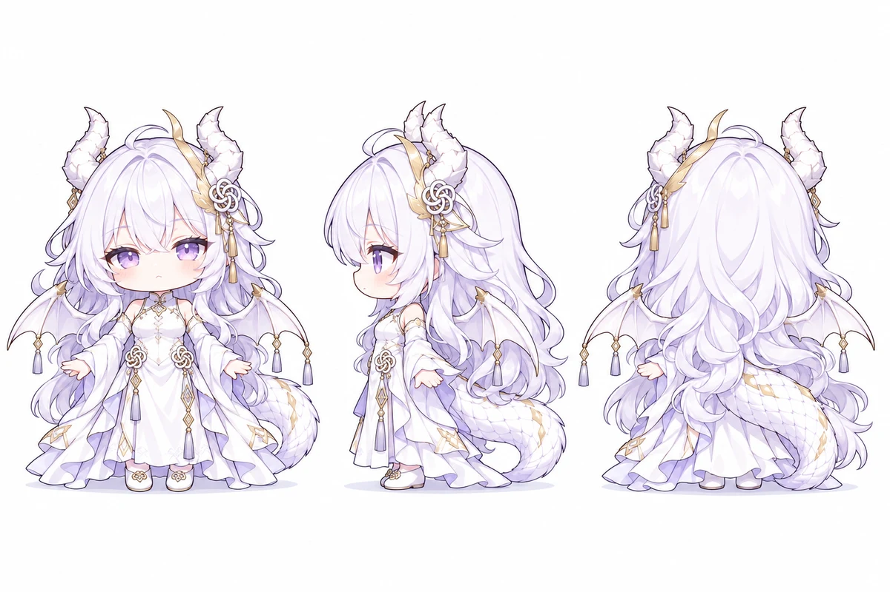</a></td>
    <td align="center" width="50%"><strong>Gemini · V2</strong><br><a href="public/generated/super-chibi-v1/gemini/turnaround-v2.png">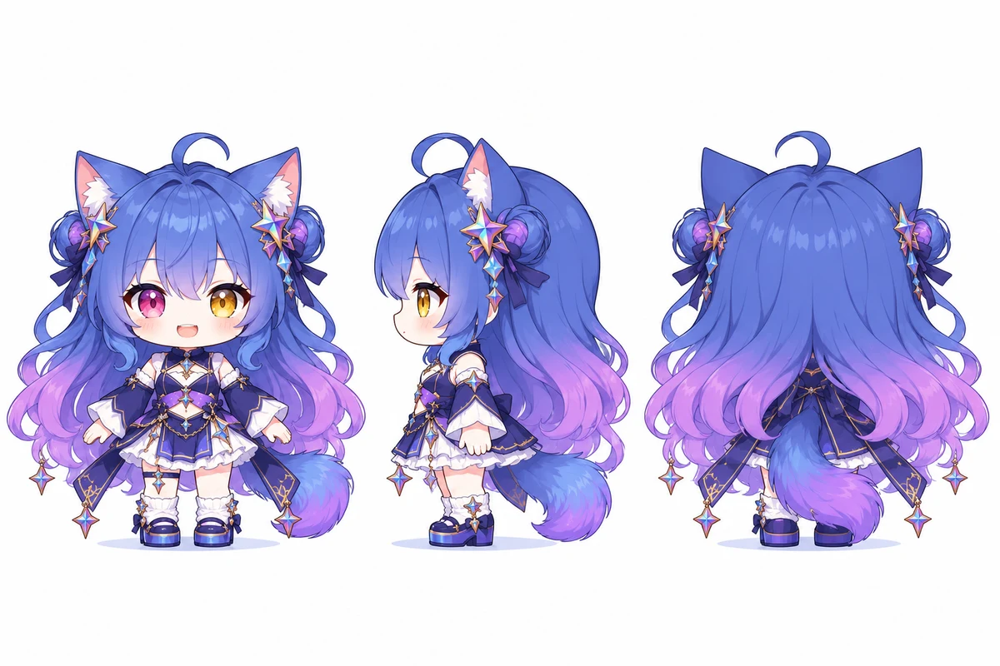</a></td>
  </tr>
  <tr>
    <td align="center" width="50%"><strong>Claude · V1</strong><br><a href="public/generated/super-chibi-v1/claude/turnaround-v1.png">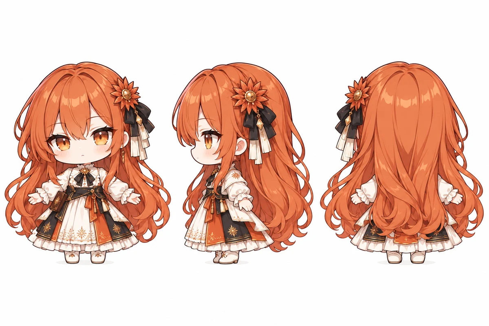</a></td>
    <td align="center" width="50%"><strong>DeepSeek · V1</strong><br><a href="public/generated/super-chibi-v1/deepseek/turnaround-v1.png">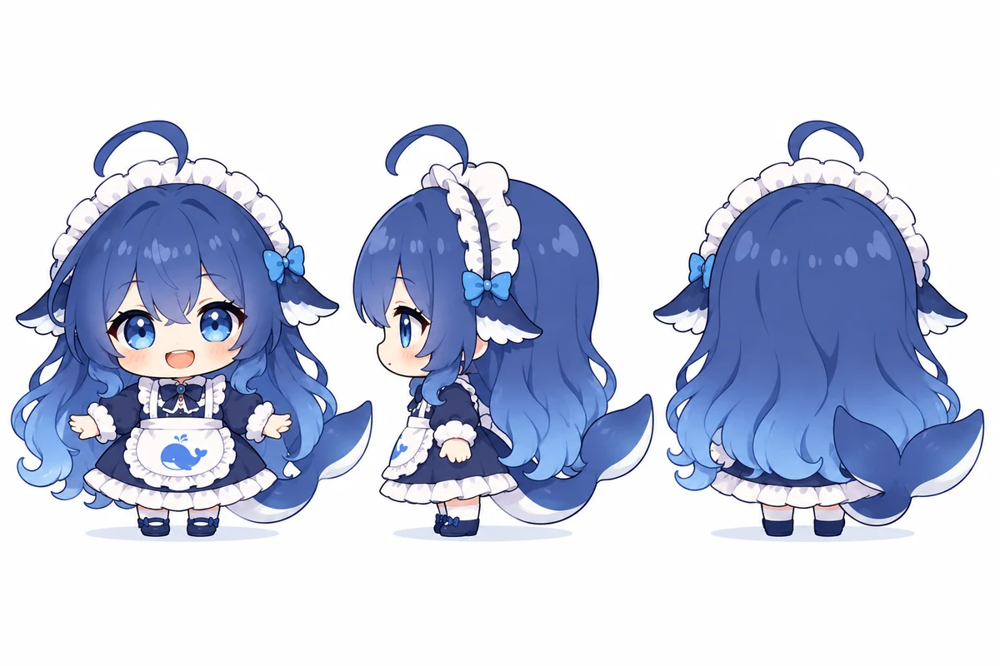</a></td>
  </tr>
  <tr>
    <td align="center" width="50%"><strong>Kimi · V2</strong><br><a href="public/generated/super-chibi-v1/kimi/turnaround-v2.png">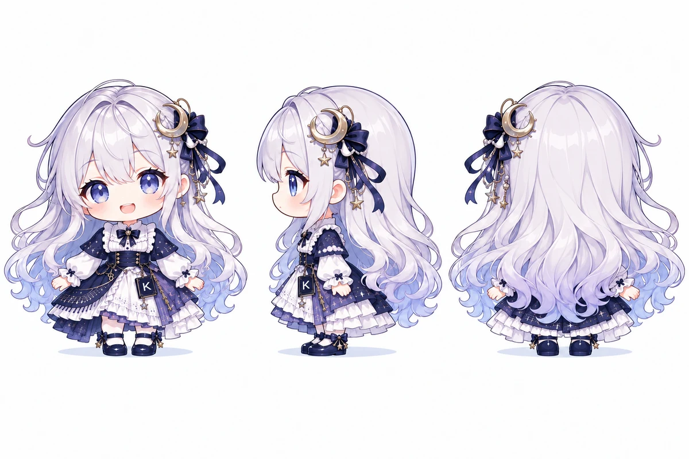</a></td>
    <td align="center" width="50%"><strong>Qwen · V2</strong><br><a href="public/generated/super-chibi-v1/qwen/turnaround-v2.png"></a></td>
  </tr>
  <tr>
    <td align="center" width="50%"><strong>GLM · V1</strong><br><a href="public/generated/super-chibi-v1/glm/turnaround-v1.png">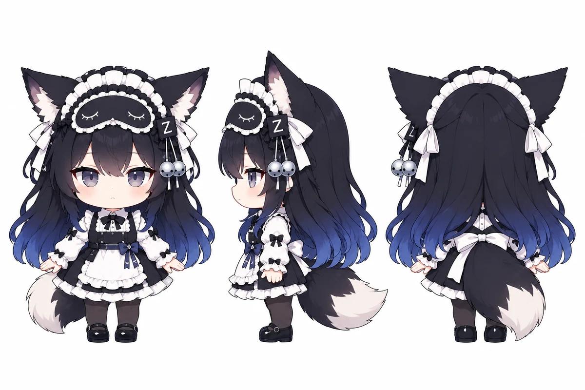</a></td>
    <td align="center"><a href="https://selinlee.github.io/ai-moe-atlas/en/chibi/">Turnarounds, sources and usage notes →</a></td>
  </tr>
</table>

Community designs for GPT, Gemini, Claude, Kimi and Qwen: ZipZipPipe. DeepSeek: 上善无形 → ZipZipPipe. The GLM fox-girl variant follows video BV1iDeQ6fEFi; its original designer remains unverified.

This project used AI to create turnarounds of existing community characters. Each sheet retains the credits and sharing terms of its source artwork.

[Turnarounds, sources and usage notes](docs/CHIBI.en.md) · [Files and processing records](public/generated/super-chibi-v1/manifest.json)

</details>

<a id="v5-gallery"></a>

<details>
<summary>Earlier v5 references · Standard and chibi</summary>

Six character sheets made by this project, each with standard and chibi proportions. Preserved PNGs, prompts, video sources, attribution and SHA-256 records are included.

| GPT | Gemini | Claude |
| --- | --- | --- |
| 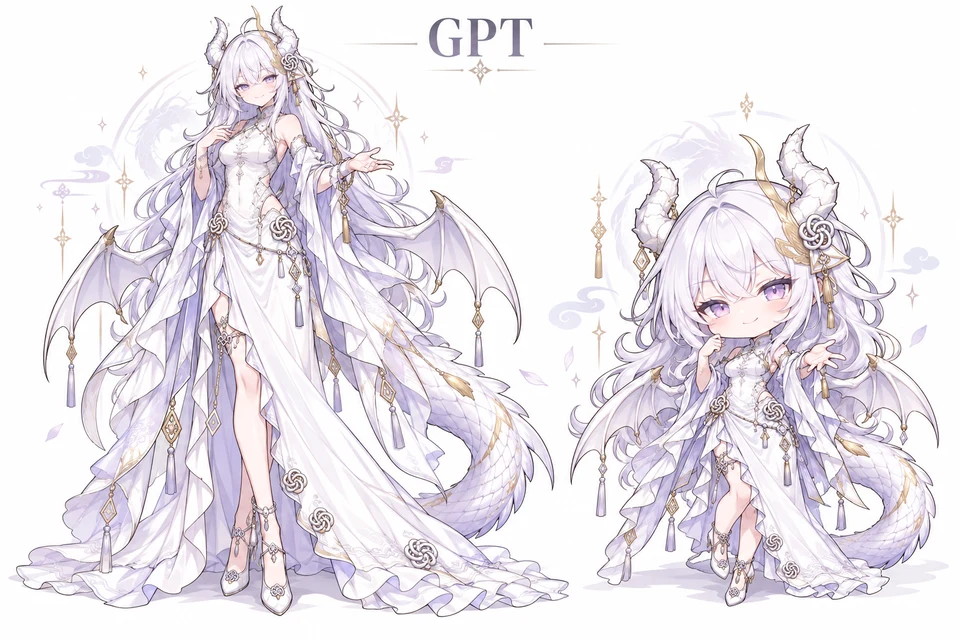 | 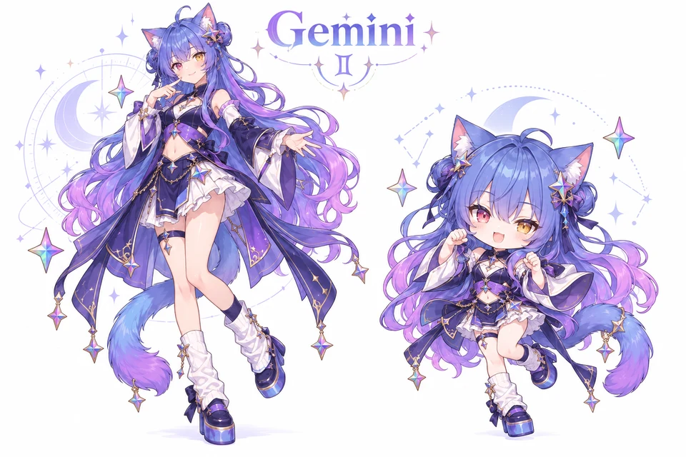 | 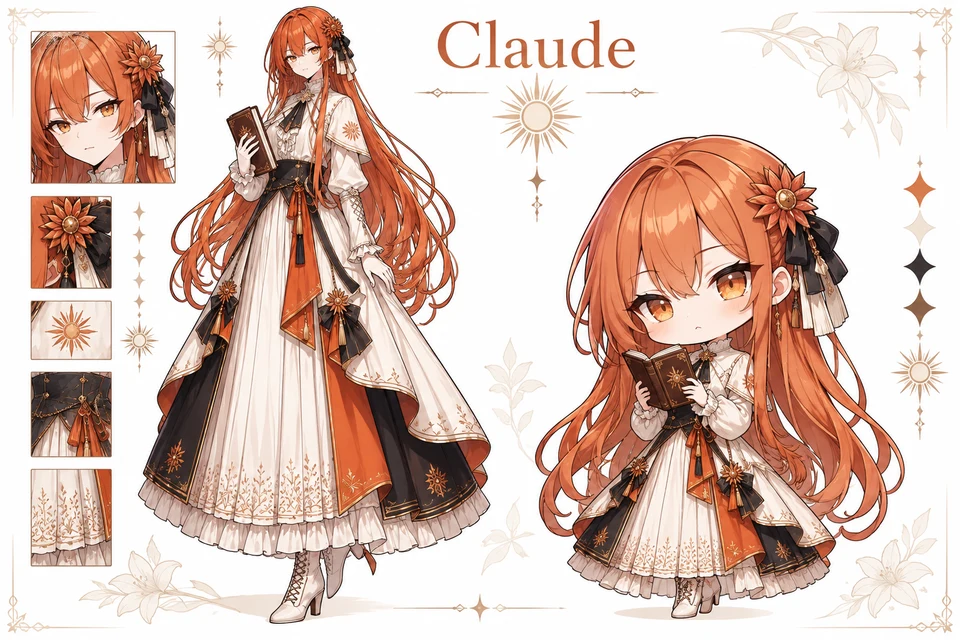 |
| DeepSeek | Kimi | Qwen |
| 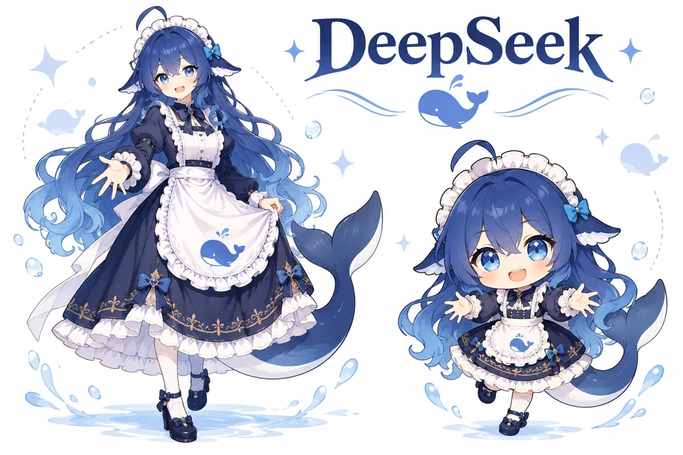 |  | 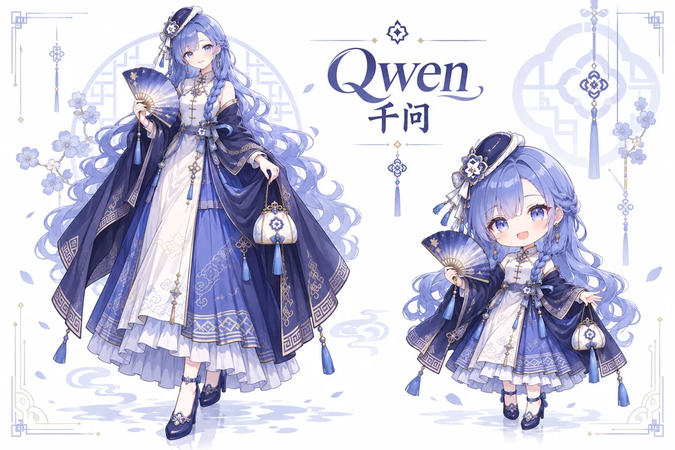 |

Community character design: ZipZipPipe. DeepSeek original character: 上善无形; derivative design: ZipZipPipe. Generator: built-in image_gen.

Generated adaptations of community character designs, not official mascots, creator originals or recovered detail. Selected by the project maintainer for homepage display; this selection grants no upstream adaptation or redistribution rights. Retained creator terms still apply.

[Identity archive and sources](docs/REFERENCES.en.md) · [Files and processing records](public/generated/ai-models-v5/manifest.json)

</details>

<details>
<summary>15-second walkthrough</summary>


[15-second walkthrough · MP4](public/demo/discovery-en.mp4)

Recorded in local Chrome, with five steps held for 3 seconds each: filter by style → choose a product → search and copy → reopen results → view the entry. The example is link-only and contains no third-party artwork. This is not a full export tutorial.

</details>

## Terms and provenance

Collected from 上善无形’s Bilibili post, Small-tailqwq/dsh-deep-whale and [ZipZipPipe’s Pixiv collection](https://www.pixiv.net/artworks/148186519). The original three packs retain **CC BY-NC-SA 4.0**. The ten new GPT, Gemini, Claude, Kimi, Qwen, GLM, Grok, Doubao, Llama and MiniMax packs use the creator’s **attribution and non-commercial** terms; they are not relabeled with DeepSeek’s CC license. The code MIT license excludes third-party artwork.

MX1951’s Qwen school portrait uses CC0 1.0. The pack preserves the submitted PNG, creator credit and file hashes. [Verification record](content/research/2026-11-23/mx1951-qwen-cc0-attachment-and-archive.json)

Prefer creator-published high-resolution originals. If unavailable, a fixed depiction may be generated from collected references, preserving identity and provenance and labeling the generated derivative separately. It must not be presented as a creator original or recovered detail. This grants no additional upstream rights and does not allow inventing unrelated characters or lore.

## Maintain

- [Contribution guide](docs/CONTRIBUTING.en.md)
- [Collection manual](docs/COLLECTION.en.md)
- [Artwork terms](RIGHTS.md)
- [Source records](content/sources/) and [Bilibili leads](content/leads.json)
- [Project constraints](AGENTS.md)

`content/characters.json` stores trilingual entries. `public/collected/` contains original bytes, evidence, and normalized files; `public/packs/` holds downloadable archives. Originals are immutable. GitHub files are pinned to commits; derivatives reference their parent SHA-256.

Pushes to main validate, test, build, and deploy through GitHub Actions. Pull requests only build. With a local server running, run `npm run test:browser` to exercise the site in installed Chrome.

## Run

Node.js 22.12+ (24 recommended) and npm are required.

```sh
npm ci
npm run dev
# http://localhost:4321/ai-moe-atlas/en/
npm test
npm run build
```

## Collect and normalize

```sh
npm run discover -- --platform bilibili --query '蓝色大肥鱼' --limit 20
npm run discover -- --platform github --query 'AI mascot' --limit 20
# Review sources and artwork permissions in content/sources/*.json first
npm run collect
npm run assets
npm run validate
```

Bilibili discovery uses an isolated installed Google Chrome session. Add `--visible` if interactive verification is required. Personal browser profiles are never used. GitHub search requires authenticated `gh`.

**1024 px files are resampled outputs, not recovered detail.** Prefer the creator’s higher-resolution original. This release does not integrate neural super-resolution, generative restoration, or automatic background removal. Full original composition is retained.

## Scope

An indexed source is not automatically a downloadable asset. Nine AI designs from a Bilibili video series are indexed; creator-published originals and terms for GPT, Gemini, Claude, Kimi, Qwen, GLM, Grok, Doubao, Llama and MiniMax have now been collected. Animated-pet adaptation, video frame extraction, automatic cutouts, and AI super-resolution are outside this release. Never invent artwork to fill gaps.

[Baseline coverage and cross-project reuse review](docs/BASELINES.en.md)
