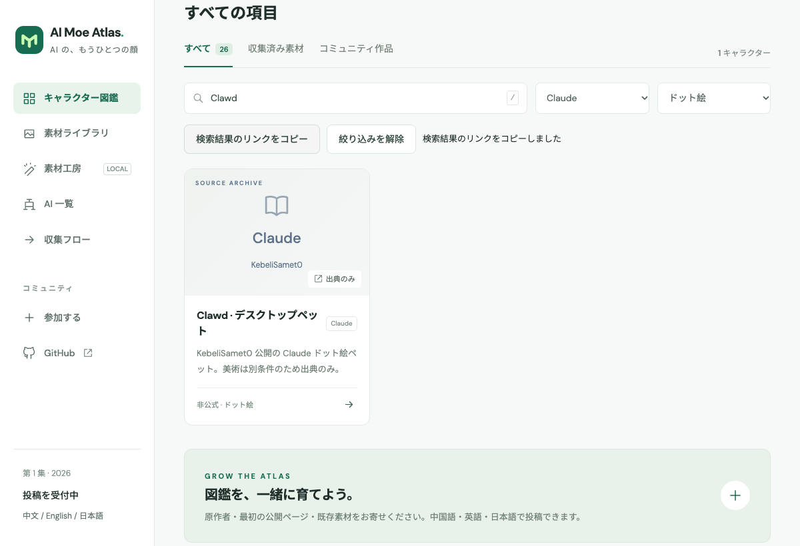

# AI 萌え図鑑 · AI Moe Atlas

[中文](README.md) · [English](README.en.md) · [日本語](README.ja.md)

いつもの AI がキャラクターになったら？公開済みの AI 萌え作品を集めた図鑑で、気になる姿から作者と出典をたどり、利用条件を確認して素材を探せます。

## [AI 萌え図鑑を開く →](https://selinlee.github.io/ai-moe-atlas/)

## ホームの形象 · ai-models-v5

ai_video の固定形象資料6枚。各画像に通常頭身とちびキャラを収録し、元の PNG・プロンプト・参照動画・作者情報・SHA-256 を保存しています。

| GPT | Gemini | Claude |
| --- | --- | --- |
|  |  |  |
| DeepSeek | Kimi | Qwen |
|  |  |  |

コミュニティのキャラクターデザイン：ZipZipPipe。DeepSeek 原作者：上善无形、二次デザイン：ZipZipPipe。生成ツール：内蔵 image_gen。

コミュニティのキャラクターを基にした生成派生資料で、公式キャラクター・作者の原図・細部の復元ではありません。管理者の指定によりホームに表示しますが、上流の改変・再配布許可を意味しません。保存済みの作者条件は引き続き適用されます。

[形象資料と出典](docs/REFERENCES.ja.md) · [ファイルと加工記録](public/generated/ai-models-v5/manifest.json)


## クジラ娘 · 3Dモデルと多視点参考図

<table>
  <tr>
    <th>全身3Dモデル v0.4</th>
    <th>AI生成の多視点参考図 v2</th>
  </tr>
  <tr>
    <td align="center" width="32%"><a href="https://selinlee.github.io/ai-moe-atlas/ja/characters/deep-whale-maid/#model-preview"></a><br><a href="https://selinlee.github.io/ai-moe-atlas/ja/characters/deep-whale-maid/#model-preview">回転できる3Dプレビューを開く</a></td>
    <td align="center" width="68%"><a href="public/models/deep-whale-maid/references/whale-maid-multiview-reference-v2.png"></a><br><a href="public/models/deep-whale-maid/references/whale-maid-multiview-reference-v2.png">参考図を原寸で見る</a></td>
  </tr>
</table>

v0.4 は頭蓋・胴体・服の奥行きを増し、短く丸い顎、広めの目の間隔、青い虹彩のグラデーションを採用。リグとアニメーションは未実装の静止全身モデルです。右側の AI 参考図は全身4方向と顔3方向を収録し、今回の改良の設計参考として使用しました。側面・背面・脚・隠れた部分は推測による補完で、作者の原設定や寸法校正済みの正投影図ではありません。

上善无形 → ZipZipPipe → Small-tailqwq。AI Moe Atlas による生成派生参考図。 [CC BY-NC-SA 4.0](https://creativecommons.org/licenses/by-nc-sa/4.0/) · [クレジット・出典・利用上の注意](public/models/deep-whale-maid/README.md).

## できること

- 出典付き26項目、AI 製品・シリーズ12種、ピックアップ8項目を閲覧。13項目の図鑑内表示用途を保存済み根拠と照合し、13組の素材集を提供しています。
- 検索語・製品・スタイル・収録種別をリンクに保存。再読み込み、履歴移動、言語切り替えでも復元できます。
- 工房で立ち絵・アイコン用キャンバス・用途確認済み紹介カード・カスタム設定を選択。クレジット付きプレビューと同じ画像を出力し、原本・根拠・加工記録を ZIP に保持します。
- 本人の未公開作品は公開 URL 不要。作者・利用声明・オリジナル確認が必須です。ローカル出力のみで、公開図鑑には追加しません。

キャラクターや作者の発見、出典付き非商用素材の制作に。画像はブラウザ内で処理されます。作品ごとの利用条件をご確認ください。

[日本語で全キャラクターを見る](https://selinlee.github.io/ai-moe-atlas/ja/) · [素材工房を開く](https://selinlee.github.io/ai-moe-atlas/ja/studio/)

## 15秒の操作デモ



[15秒の操作デモ · MP4](public/demo/discovery-ja.mp4)

ローカル Chrome の実画面を各3秒ずつ表示する5ステップ：スタイルで絞る → 製品を選ぶ → 検索してリンクをコピー → 結果を開き直す → 項目を確認。出典リンクのみの項目を使用し、第三者の作品画像は含みません。書き出し全体のチュートリアルではありません。

## 利用条件と出典

上善无形の Bilibili 投稿、Small-tailqwq/dsh-deep-whale、[ZipZipPipe 本人の Pixiv 作品集](https://www.pixiv.net/artworks/148186519)から収集。従来の3組は **CC BY-NC-SA 4.0**。追加の GPT・Gemini・Claude・Kimi・Qwen・GLM・Grok・豆包・Llama・MiniMax の10組は作者の **クレジット必須・非商用** 条件に従い、DeepSeek の CC 許諾とは区別します。コードの MIT は第三者の画像には適用されません。

作者が公開した高解像度原図を優先します。入手できない場合、収集した参照画像を基に同一の姿を保つ派生画像を生成できますが、作者・出典・加工履歴を保持し、生成派生物として別途明記します。作者の原図や復元された細部とは表記しません。クジラ娘の独立した生成参考図は上の3D欄に掲載しています。工房に生成処理は組み込んでいません。上流の許諾を拡大せず、無関係なキャラクターや設定の創作も認めません。

## 維持・更新

- [素材工房ガイド](docs/STUDIO.ja.md)
- [投稿ガイド](docs/CONTRIBUTING.ja.md)
- [収集マニュアル](docs/COLLECTION.ja.md)
- [素材の利用条件](RIGHTS.md)
- [出典記録](content/sources/)・[Bilibili 調査候補](content/leads.json)
- [プロジェクトの制約](AGENTS.md)

三言語の項目は `content/characters.json`、原図・根拠・加工結果は `public/collected/`、素材集は `public/packs/` に保存。原本は上書きせず、GitHub ファイルはコミットに固定し、派生ファイルから親原図の SHA-256 を参照します。

main への push で検証・テスト・ビルド・GitHub Pages 公開を実行。PR はビルドのみです。ローカルサーバー起動後、`npm run test:browser` で Chrome テストを実行できます。

## 起動

Node.js 22.12 以上（24 推奨）と npm が必要です。

```sh
npm ci
npm run dev
# http://localhost:4321/ai-moe-atlas/ja/
npm test
npm run build
```

## 収集・規格統一

```sh
npm run discover -- --platform bilibili --query '蓝色大肥鱼' --limit 20
npm run discover -- --platform github --query 'AI mascot' --limit 20
# content/sources/*.json の出典・美術利用条件を確認してから実行
npm run collect
npm run assets
npm run validate
```

Bilibili 検索はインストール済み Google Chrome の独立セッションを使用。確認画面が必要な場合は `--visible` を追加します。個人のブラウザプロファイルは使用しません。GitHub 検索にはログイン済みの `gh` が必要です。

**1024 px 版はリサイズ・補間の出力であり、細部を復元したものではありません。** 作者の高解像度原図を優先します。ニューラル超解像、生成型修復、自動背景除去は未実装。元の構図全体を保持します。

## 対応範囲

出典索引への掲載はダウンロード許可を意味しません。Bilibili の 9 種の AI 形象を索引化し、GPT・Gemini・Claude・Kimi・Qwen・GLM・Grok・豆包・Llama・MiniMax は作者の個別高解像度原画像を収集済みです。ペットアニメーション、動画のコマ抽出、自動切り抜き、AI 超解像は本版に含みません。数合わせのために形象を創作してはいけません。

[各 AI の画像収集と再利用の確認記録](docs/BASELINES.ja.md)
