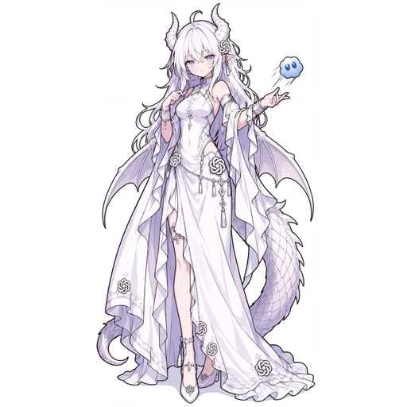
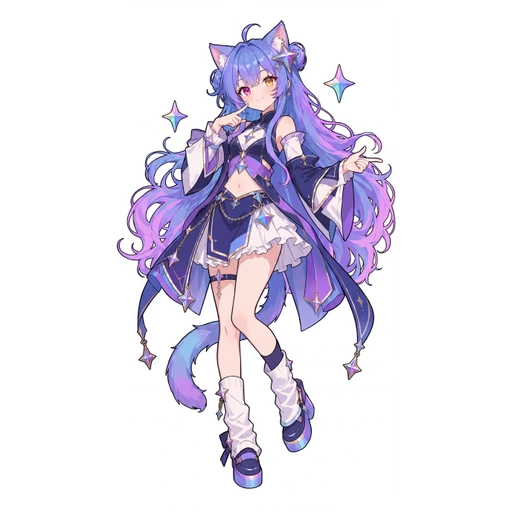
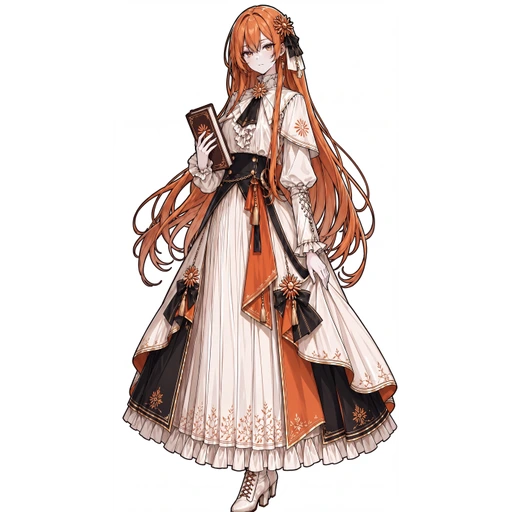
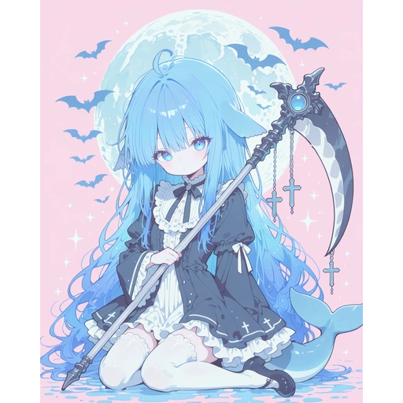
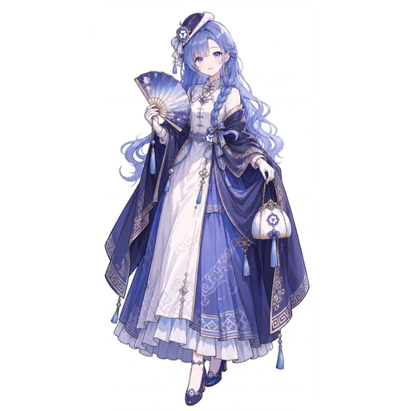
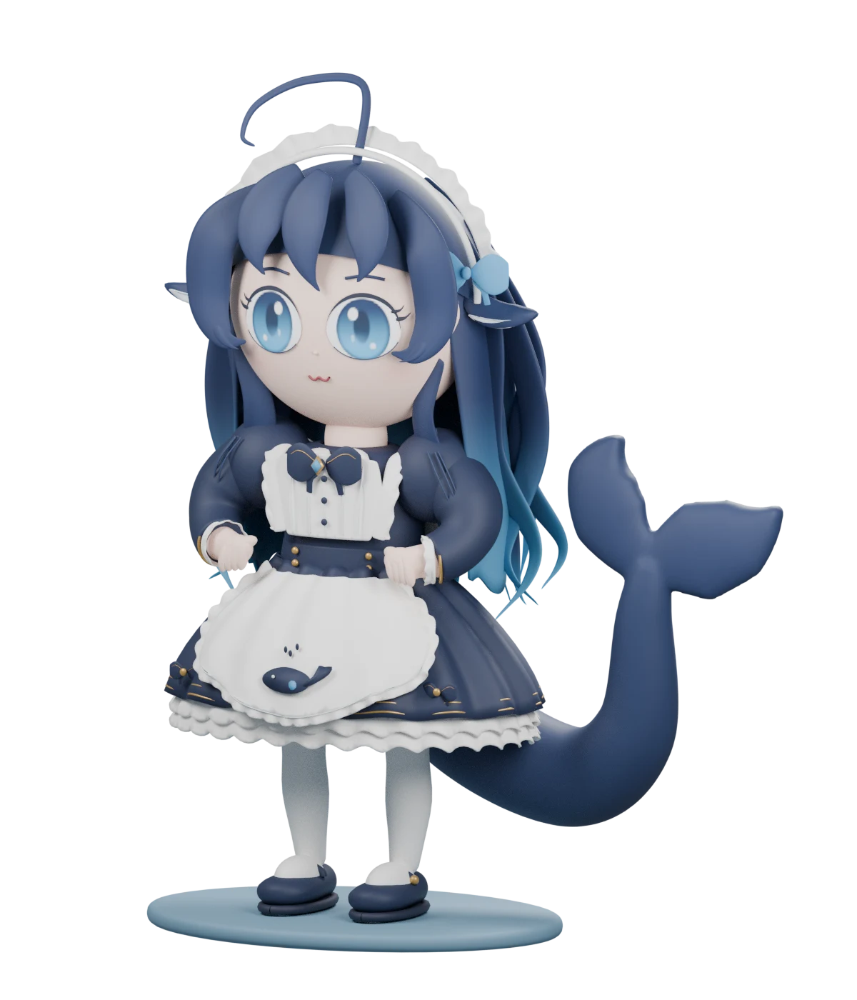
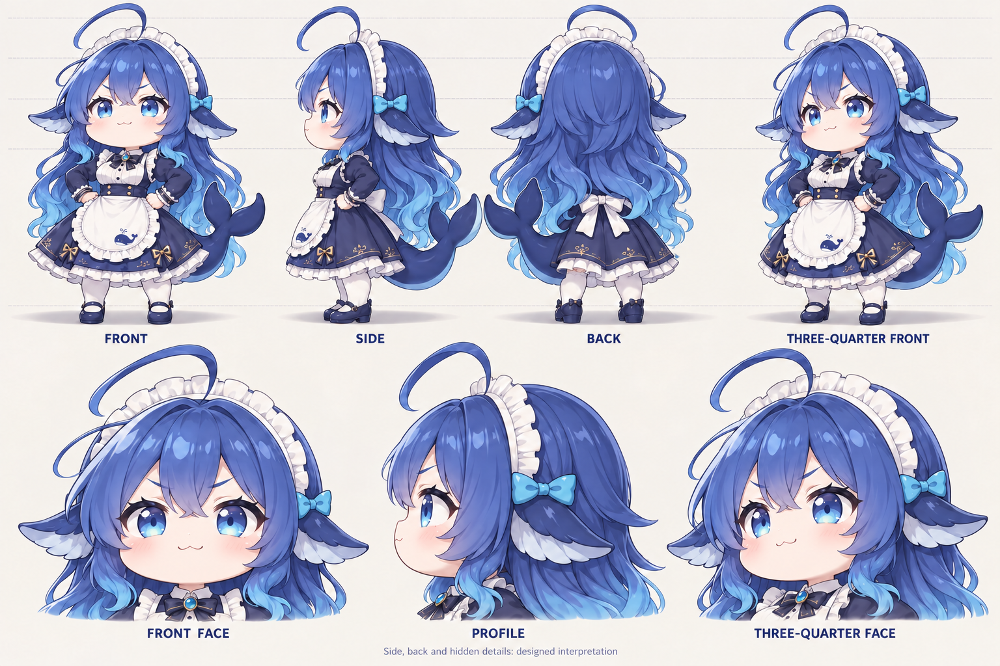
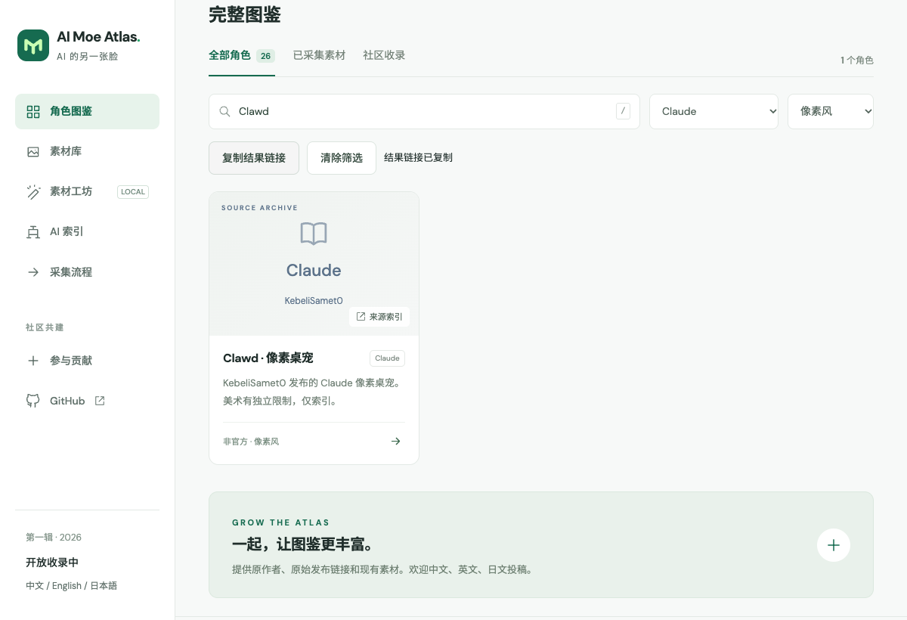

# AI 萌化百科 · AI Moe Atlas

[中文](README.md) · [English](README.en.md) · [日本語](README.ja.md)

当熟悉的 AI 化身为角色，会是什么模样？这里收集已有的 AI 萌化作品，让你从一张图认识角色、找到作者，再按使用条件取用素材。

## [打开 AI 萌化图鉴 →](https://selinlee.github.io/ai-moe-atlas/)

看完整角色图、查原作与作者、下载可用素材包。点击下方角色，直接进入对应词条。

<table>
  <tr>
    <td align="center" width="33%">
      <a href="https://selinlee.github.io/ai-moe-atlas/zh/characters/zipzippipe-chatgpt/"></a><br>
      <a href="https://selinlee.github.io/ai-moe-atlas/zh/characters/zipzippipe-chatgpt/"><strong>GPT</strong></a><br>
      <sub><a href="https://www.pixiv.net/artworks/148186519">ZipZipPipe</a></sub>
    </td>
    <td align="center" width="33%">
      <a href="https://selinlee.github.io/ai-moe-atlas/zh/characters/zipzippipe-gemini/"></a><br>
      <a href="https://selinlee.github.io/ai-moe-atlas/zh/characters/zipzippipe-gemini/"><strong>Gemini</strong></a><br>
      <sub><a href="https://www.pixiv.net/artworks/148186519">ZipZipPipe</a></sub>
    </td>
    <td align="center" width="33%">
      <a href="https://selinlee.github.io/ai-moe-atlas/zh/characters/zipzippipe-claude/"></a><br>
      <a href="https://selinlee.github.io/ai-moe-atlas/zh/characters/zipzippipe-claude/"><strong>Claude</strong></a><br>
      <sub><a href="https://www.pixiv.net/artworks/148186519">ZipZipPipe</a></sub>
    </td>
  </tr>
  <tr>
    <td align="center" width="33%">
      <a href="https://selinlee.github.io/ai-moe-atlas/zh/characters/shangshan-whale/"></a><br>
      <a href="https://selinlee.github.io/ai-moe-atlas/zh/characters/shangshan-whale/"><strong>鲸鱼娘 · 上善无形原作</strong></a><br>
      <sub><a href="https://www.bilibili.com/opus/1231977657712771073">上善无形</a><br>DeepSeek 二创的上游角色</sub>
    </td>
    <td align="center" width="33%">
      <a href="https://selinlee.github.io/ai-moe-atlas/zh/characters/zipzippipe-kimi/"></a><br>
      <a href="https://selinlee.github.io/ai-moe-atlas/zh/characters/zipzippipe-kimi/"><strong>Kimi</strong></a><br>
      <sub><a href="https://www.pixiv.net/artworks/148186519">ZipZipPipe</a></sub>
    </td>
    <td align="center" width="33%">
      <a href="https://selinlee.github.io/ai-moe-atlas/zh/characters/zipzippipe-qwen/"></a><br>
      <a href="https://selinlee.github.io/ai-moe-atlas/zh/characters/zipzippipe-qwen/"><strong>千问 · Qwen</strong></a><br>
      <sub><a href="https://www.pixiv.net/artworks/148186519">ZipZipPipe</a></sub>
    </td>
  </tr>
</table>

画廊展示已收集的非官方作品。预览仅做等比缩放、留边和格式转换，不裁切原图、不重绘；原文件和加工记录保留在仓库中。

<sub>GPT、Gemini、Claude、Kimi、千问：<a href="https://www.pixiv.net/artworks/148186519">ZipZipPipe</a>，署名、非商用；鲸鱼娘：<a href="https://www.bilibili.com/opus/1231977657712771073">上善无形</a>，<a href="https://creativecommons.org/licenses/by-nc-sa/4.0/">CC BY-NC-SA 4.0</a>。<a href="RIGHTS.md">逐件使用条件与证据</a>。</sub>

## 鲸鱼娘 · 3D 模型与多视图参考

<table>
  <tr>
    <th>3D 全身模型 v0.3</th>
    <th>AI 生成多视图参考 v2</th>
  </tr>
  <tr>
    <td align="center" width="32%"><a href="https://selinlee.github.io/ai-moe-atlas/zh/characters/deep-whale-maid/#model-preview"></a><br><a href="https://selinlee.github.io/ai-moe-atlas/zh/characters/deep-whale-maid/#model-preview">打开可旋转 3D 预览</a></td>
    <td align="center" width="68%"><a href="public/models/deep-whale-maid/references/whale-maid-multiview-reference-v2.png"></a><br><a href="public/models/deep-whale-maid/references/whale-maid-multiview-reference-v2.png">查看完整参考图</a></td>
  </tr>
</table>

四个全身视角与三个脸部研究图，供后续建模对照。侧面、背面、腿部与遮挡细节为设计性补充；并非作者原始设定图或校准正交图。参考图单独提供，现有 v0.3 模型未因本次加图而改变。

上善无形 → ZipZipPipe → Small-tailqwq；AI Moe Atlas 生成派生参考。 [CC BY-NC-SA 4.0](https://creativecommons.org/licenses/by-nc-sa/4.0/) · [署名、来源与使用说明](public/models/deep-whale-maid/README.md).

## 现在可以做什么

- 浏览 26 个来源条目、12 个 AI 产品／系列和 8 个精选角色。13 个条目的本站展示用途已按留存证据核对，13 组素材包可下载。
- 搜索、产品、风格与收录类型随链接保存；刷新、前进后退、切换语言后可恢复。
- 工坊提供完整立绘、头像画布、经用途核对开放的介绍卡和自定义参数。成品带可见署名，预览与导出一致；ZIP 保留原始文件、证据和处理记录。
- 支持本人未公开原创作品：无需公开链接，须填写作者、使用声明并确认原创；只在本地导出，不进入公开库。

适合发现角色、查找作者和制作有出处的非商业素材。图片在浏览器本地处理；请逐件阅读使用条件。

[浏览全部角色](https://selinlee.github.io/ai-moe-atlas/zh/) · [打开素材工坊](https://selinlee.github.io/ai-moe-atlas/zh/studio/)

## 15 秒操作演示



[15 秒操作演示 · MP4](public/demo/discovery-zh.mp4)

本机 Chrome 实拍，五个步骤各停留 3 秒：按风格筛选 → 选择产品 → 搜索并复制链接 → 重新打开结果 → 查看词条。示例使用仅索引条目，画面不含第三方作品图；这不是完整导出教程。

## 使用条件与来源

素材来自上善无形的 B 站原始动态、Small-tailqwq/dsh-deep-whale，以及 ZipZipPipe 本人的 [Pixiv 原图集](https://www.pixiv.net/artworks/148186519)。原有三包为 **CC BY-NC-SA 4.0**；新增 GPT、Gemini、Claude、Kimi、千问、GLM、Grok、豆包、Llama、MiniMax 十包按作者的 **署名、非商用** 条件提供，不套用 DeepSeek 的 CC 许可。仓库代码的 MIT 许可不覆盖第三方图片。

优先获取原作者发布的高清原图；原图不可得时，可依据已收集参考制作固定形象派生图，并单独标注生成来源、身份与加工记录，不冒充作者原图或恢复出的细节。鲸鱼娘的独立生成参考图见上方 3D 区域；工坊未集成生成式处理，不扩大上游许可，也不允许凭空新造无关角色或设定。

## 资料与维护

- [工坊使用指南](docs/STUDIO.zh.md)
- [投稿指南](CONTRIBUTING.md)
- [采集操作手册](docs/COLLECTION.zh.md)
- [素材使用条件](RIGHTS.md)
- [来源记录](content/sources/)、[B 站研究线索](content/leads.json)
- [项目约束](AGENTS.md)

`content/characters.json` 是三语角色资料；`public/collected/` 保存原图、来源证据和规范化结果；`public/packs/` 保存下载包。原图不可覆盖，GitHub 素材固定到具体提交，派生文件通过 SHA-256 指向父原图。

推送 main 后，GitHub Actions 验证资料与来源关系、运行测试并发布 GitHub Pages。PR 仅构建，不发布。浏览器测试：先启动本地服务，再执行 `npm run test:browser`。

## 运行

需要 Node.js 22.12+（推荐 24）和 npm。

```sh
npm ci
npm run dev
# http://localhost:4321/ai-moe-atlas/zh/
npm test
npm run build
```

## 收集与加工

```sh
# 使用独立的本机 Google Chrome 会话搜索 B 站，需安装 Chrome
npm run discover -- --platform bilibili --query '蓝色大肥鱼' --limit 20
# 页面要求验证时可以加 --visible；不使用个人浏览器资料
npm run discover -- --platform github --query 'AI mascot' --limit 20
# 人工核验后维护 content/sources/*.json，再采集原图
npm run collect
# 仅对已核验的原图执行确定性的本地规范化处理
npm run assets
npm run validate
```

GitHub 搜索需要已登录的 `gh`。首次安装 Playwright 只用于控制本机 Chrome，无需安装 Chromium。

**1024 px 版是插值或缩放输出，不代表恢复了真实细节。** 优先寻找作者高清原图；当前未集成神经网络超分辨率或生成式修复，也不默认抠除背景。所有导出保留整张原图的内容。

## 已知范围

来源条目并不等于可下载素材。B 站九款 AI 的视频系列已建立索引；其中 GPT、Gemini、Claude、Kimi、千问、GLM、Grok、豆包、Llama、MiniMax 已找到并采集作者独立高清原图。桌宠动画适配、视频提帧、自动抠图与 AI 超分不包含在本版中。禁止为凑数量而新造形象。

[每个 AI 的保底形象与跨项目复用核对](docs/BASELINES.zh.md)
